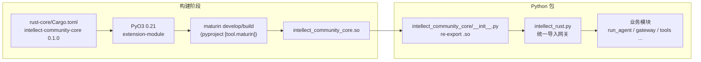
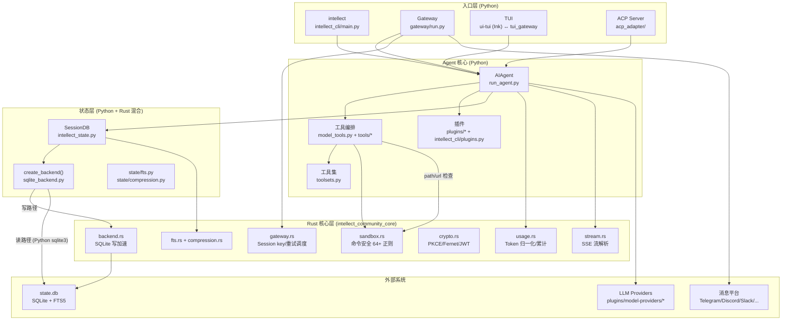
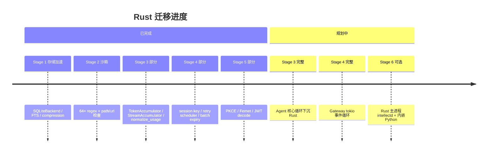

# Intellect Agent：Rust ↔ Python 架构梳理

> 文档日期：2026-06-16  
> 适用版本：Python `intellect-agent` 0.6.3 / Rust `intellect-community-core` 0.1.0

## 1. 总体定位

Intellect Agent 是一个 **Python 为主进程、Rust 为性能/安全核心** 的混合架构项目。Python 层负责 CLI/TUI、工具编排、Gateway 平台适配、插件系统等（约 270+ 工具模块）；Rust 层通过 **PyO3 + maturin** 编译为原生扩展 `intellect_community_core`，承担存储加速、沙箱检测、加密、流式解析、Gateway 调度等热路径。

相关文档：

- 迁移路线图：`docs/plans/2026-06-10-rust-migration-plan.md`
- v0.6.2 Breaking Change 说明：`RELEASE_v0.6.2.md`
- Rust 模块 README：`rust-core/README.md`
- 跨平台打包设计：`docs/packaging/design.md`
- Gitee Release 与 Native 包：`docs/packaging/gitee-releases.md`
- Docker 版本标签：`docs/packaging/docker.md`

---

## 2. 版本关系

| 维度 | Python | Rust |
|------|--------|------|
| **包名** | `intellect-agent` | `intellect-community-core` (Cargo) |
| **当前版本** | `0.6.3` (`pyproject.toml`) | `0.1.0` (`rust-core/Cargo.toml`) |
| **版本是否绑定** | **否** — Rust crate 独立 semver，不与 Python 主版本同步 |
| **Python 模块名** | — | `intellect_community_core` (编译产物 `.so`/`.pyd`) |
| **Python 版本要求** | `>=3.12` | 由 PyO3 0.21 决定，CI 中在 3.11/3.12 上测试 |
| **构建方式** | `pip install -e .` / `uv sync` | **单独** `maturin develop --release` |
| **pip 是否自动编译 Rust** | **否** — setuptools 只装 Python 包 |

### 版本交互模型

```
intellect-agent 0.6.x          intellect-community-core 0.1.0
        │                                    │
        │  逻辑耦合（API 契约）               │
        └──────────────┬─────────────────────┘
                       │
              maturin develop / build
                       │
              import intellect_community_core
```

**关键结论：**

- **发布版本不同步**：Python 已到 v0.6.3，Rust crate 仍为 v0.1.0；二者通过 **函数/类 API 契约** 耦合，而非版本号对齐。
- **运行时依赖（v0.6.2+）**：Rust 扩展从「可选加速」变为 **硬性依赖**（见 `RELEASE_v0.6.2.md`）。缺少扩展时，各模块在调用 Rust 函数时会直接失败，不再走 Python 回退。
- **构建与安装分离**：`pyproject.toml` 注释仍写 "optional"，但 v0.6.2 起实际运行必须手动构建：

  ```bash
  pip install maturin
  cd rust-core && maturin develop --release
  ```

- **CI 验证**：`.github/workflows/tests.yml` 单独 job 执行 `cargo test` → `maturin develop` → `maturin build --release` → parity 测试。

---

## 3. 绑定与集成机制

### 3.1 构建链路



**构建配置要点：**

| 文件 | 作用 |
|------|------|
| `rust-core/Cargo.toml` | Rust crate 定义，`crate-type = ["cdylib", "rlib"]` |
| `pyproject.toml` `[tool.maturin]` | 指定 `manifest`、`module-name`、`python-source` |
| `intellect_community_core/__init__.py` | 从编译产物 re-export 所有符号 |
| `Makefile` | `make rust-build` / `make rust-dev` 快捷目标 |

### 3.2 统一适配层 `intellect_rust.py`

所有 Rust 调用 **集中经过** 这一模块，避免在各处散落 `try/import`：

```python
try:
    import intellect_community_core as _core
    _CORE = _core
except ImportError:
    _CORE = None

def ensure_rust_available() -> None:
    if not _has():
        raise RuntimeError(
            "The intellect_community_core Rust extension is not installed. "
            "Build it with: cd rust-core && maturin develop --release"
        )
```

导出内容包括：`SQLiteBackend`、`TokenAccumulator`、`StreamAccumulator`、`PlatformRetryScheduler`，以及 sandbox/crypto/gateway/fts 等函数别名。

### 3.3 Rust 模块导出（`rust-core/src/lib.rs`）

Python 模块名：`import intellect_community_core`

| 阶段 | Rust 源文件 | 导出内容 |
|------|-------------|----------|
| Stage 1b | `fts.rs`, `compression.rs` | FTS5 工具、压缩链 CTE |
| Stage 1c | `backend.rs`, `connection.rs` | `SQLiteBackend`, `RustConnection`, `RustCursor` |
| Stage 2 | `sandbox.rs` | 命令检测、路径/URL 安全检查 |
| Stage 3 | `usage.rs`, `stream.rs` | `TokenAccumulator`, `StreamAccumulator`, `normalize_usage_rs` |
| Stage 4 | `gateway.rs` | Session key、重置策略、批量过期、`PlatformRetryScheduler` |
| Stage 5 | `crypto.rs` | PKCE、Fernet、安全随机、JWT decode |

---

## 4. 系统结构总览



### 入口点

| 命令 | 模块 | 说明 |
|------|------|------|
| `intellect` | `intellect_cli/main.py` | 交互式 CLI / 子命令分发 |
| `intellect-agent` | `run_agent.py` | Agent 库入口 |
| `intellect-acp` | `acp_adapter/entry.py` | 编辑器 ACP 集成 |
| `intellect --tui` | `ui-tui/` + `tui_gateway/` | Ink TUI + JSON-RPC 后端 |
| `intellect gateway` | `gateway/run.py` | 消息 Gateway |

---

## 5. Rust ↔ Python 按域交互表

| 域 | Rust 模块 | Python 消费方 | 交互方式 |
|----|-----------|---------------|----------|
| **存储** | `backend.rs`, `connection.rs` | `agent/storage/sqlite_backend.py` → `intellect_state.py` | **混合模式**：Rust 负责写+WAL checkpoint；Python `sqlite3` 负责读 |
| **FTS/压缩** | `fts.rs`, `compression.rs` | `state/fts.py`, `state/compression.py` | 函数调用 |
| **沙箱** | `sandbox.rs` (64+ 正则) | `tools/approval.py` | 命令归一化后调用 `detect_*_rs` |
| **路径/URL 安全** | `sandbox.rs` | `tools/path_security.py`, `tools/url_safety.py` | 直接调用 |
| **Token 用量** | `usage.rs` | `run_agent.py`, `agent/usage_pricing.py` | `TokenAccumulator` 类 + `normalize_usage_rs` |
| **流式响应** | `stream.rs` | `agent/chat_completion_helpers.py` | `StreamAccumulator` 累积 SSE delta |
| **加密/OAuth** | `crypto.rs` | `agent/oauth/*`, `agent/secret_store.py` | PKCE、Fernet 加解密 |
| **Gateway** | `gateway.rs` | `gateway/session.py` | Session key 构建、批量过期检查、`PlatformRetryScheduler` |

### 典型调用链

**命令审批（沙箱）：**

```
terminal 工具 → approval.py
  → _normalize_command_for_detection()
  → rust_detect_hardline / rust_detect_dangerous  (Rust regex)
  → 批准/拒绝
```

**Session 存储（混合读写）：**

```
SessionDB → create_backend() → RustSQLiteBackend
  ├── _backend (Rust SQLiteBackend)  → execute_write, FTS, compression
  └── _python_conn (Python sqlite3)  → SELECT / cursor 读操作
```

**Agent 对话循环：**

```
run_agent.py → chat_completion_helpers.py
  ├── StreamAccumulator (Rust)  ← SSE 流
  ├── TokenAccumulator (Rust)   ← 用量统计
  └── handle_function_call()    ← 工具执行仍在 Python
```

### Python 消费方完整列表

| Python 模块 | 导入的 Rust 符号 |
|-------------|-----------------|
| `agent/storage/sqlite_backend.py` | `SQLiteBackend` |
| `state/fts.py` | `rust_is_fts5_unavailable_error`, `rust_drop_fts_triggers`, … |
| `state/compression.py` | `rust_get_compression_tip` |
| `tools/approval.py` | `rust_detect_hardline`, `rust_detect_dangerous`, `rust_check_sudo_stdin` |
| `tools/path_security.py` | `rust_is_forbidden_path` |
| `tools/url_safety.py` | `rust_is_ip_blocked` |
| `agent/usage_pricing.py` | `rust_normalize_usage` |
| `run_agent.py` | `TokenAccumulator` |
| `agent/chat_completion_helpers.py` | `StreamAccumulator` |
| `agent/oauth/__init__.py` | `rust_pkce_challenge`, `rust_secure_hex` |
| `agent/oauth/storage.py` | `rust_fernet_encrypt`, `rust_fernet_decrypt` |
| `agent/secret_store.py` | `rust_fernet_encrypt`, `rust_fernet_decrypt` |
| `gateway/session.py` | `PlatformRetryScheduler`, `rust_build_session_key`, `rust_check_expiry_batch` |

---

## 6. 仍在 Python 的部分（Rust 未迁移）

按 `docs/plans/2026-06-10-rust-migration-plan.md` 六阶段规划，当前 Rust 覆盖 Stage 1–5 的子集，以下 **仍完全在 Python**：

- **270+ 工具** (`tools/*`) 及 MCP 集成
- **Agent 主循环** 逻辑框架 (`run_agent.py` ~12k LOC)
- **CLI/TUI** 交互 (`cli.py`, `ui-tui/`, `tui_gateway/`)
- **Gateway 平台适配器** (`gateway/platforms/*`) — Rust 只提供 session/重试工具，不含 tokio 事件循环
- **插件系统** (`plugins/*`, model-providers, memory providers)
- **Memory/RAG** (`agent/memory_manager.py`, `plugins/memory/*`)
- **Provider 适配** (`agent/chat_completion_helpers.py` 主体)

---

## 7. 架构演进状态



---

## 8. 开发/部署注意事项

1. **开发环境**：`make rust-build` 或 `cd rust-core && maturin develop --release`，再 `pip install -e .`
2. **测试**：
   - 主测试 suite：`scripts/run_tests.sh`
   - Rust 单元测试：`cd rust-core && cargo test`
   - Rust/Python parity：`scripts/run_tests.sh tests/intellect_state/test_rust_parity.py`
3. **纯 Python 安装已废弃**：`make install-pure` 仍存在，但 v0.6.2+ 运行时会因缺少 Rust 扩展而失败
4. **文档滞后**：
   - `rust-core/README.md` 仍描述 `_HAS_RUST` 回退标志
   - `pyproject.toml` 注释写 "optional"
   - 以 `RELEASE_v0.6.2.md` 和 `intellect_rust.py` 为准

### Rust 依赖（Cargo.toml）

```toml
pyo3 = "0.21"       # Python bindings
rusqlite = "0.31"   # SQLite (bundled, FTS5 included)
regex = "1"         # 命令安全正则
serde_json = "1"    # JSON 序列化
sha2, base64, hex   # 哈希/编码
aes, cbc, hmac, pbkdf2  # Fernet 加密
rand = "0.8"        # CSPRNG
```

---

## 9. 小结

Intellect Agent 采用 **「Python 编排 + Rust 热路径加速」** 的 PyO3 嵌入式架构：

| 维度 | 说明 |
|------|------|
| **版本** | Python `0.6.3` 与 Rust crate `0.1.0` **独立编号**，通过 API 契约耦合 |
| **构建** | maturin 单独编译，不随 `pip install` 自动完成 |
| **运行** | v0.6.2 起 Rust 为 **硬性依赖**，经 `intellect_rust.py` 统一接入 |
| **边界** | 工具执行、Gateway 平台 I/O、插件、Memory 仍在 Python；存储写、安全检测、加密、流解析、Gateway 调度逻辑在 Rust |
