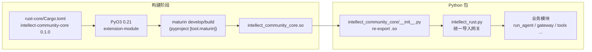
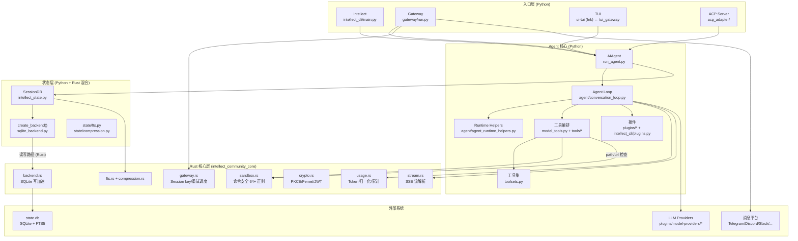
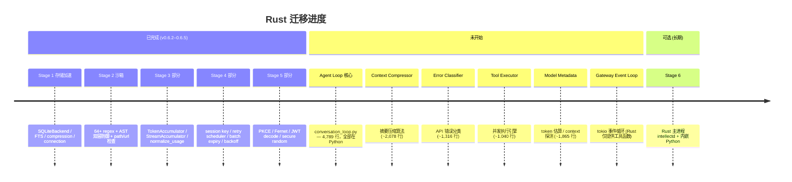

# Intellect Agent：Rust ↔ Python 架构梳理

> 文档日期：2026-06-19  
> 适用版本：Python `intellect-agent` 0.6.5 / Rust `intellect-community-core` 0.1.0

## 1. 总体定位

Intellect Agent 是一个 **Python 为主进程、Rust 为性能/安全核心** 的混合架构项目。Python 层负责 CLI/TUI、工具编排、Gateway 平台适配、插件系统等（约 270+ 工具模块）；Rust 层通过 **PyO3 + maturin** 编译为原生扩展 `intellect_community_core`，承担存储加速、沙箱检测、加密、流式解析、Gateway 调度等热路径。

相关文档：

- 迁移路线图（已归档）：`docs/plans/archive/2026-06-18-archived-rust-migration-plan.md`
- v0.6.2 Breaking Change 说明：`RELEASE_v0.6.2.md`
- Rust 模块 README：`rust-core/README.md`
- 跨平台打包设计：`docs/packaging/design.md`
- Gitee Release 与 Native 包：`docs/packaging/gitee-releases.md`
- Docker 版本标签：`docs/packaging/docker.md`

---

## 2. 版本关系

| 维度 | Python | Rust |
|------|--------|------|
| **包名** | `intellect-agent` | `intellect-community-core` (Cargo) |
| **当前版本** | `0.6.5` (`pyproject.toml`) | `0.1.0` (`rust-core/Cargo.toml`) |
| **版本是否绑定** | **否** — Rust crate 独立 semver，不与 Python 主版本同步 |
| **Python 模块名** | — | `intellect_community_core` (编译产物 `.so`/`.pyd`) |
| **Python 版本要求** | `>=3.12` | 由 PyO3 0.21 决定，CI 中在 3.11/3.12 上测试 |
| **构建方式** | `pip install -e .` / `uv sync` | **单独** `maturin develop --release` |
| **pip 是否自动编译 Rust** | **否** — setuptools 只装 Python 包 |

### 版本交互模型

```
intellect-agent 0.6.x          intellect-community-core 0.1.0
        │                                    │
        │  逻辑耦合（API 契约）               │
        └──────────────┬─────────────────────┘
                       │
              maturin develop / build
                       │
              import intellect_community_core
```

**关键结论：**

- **发布版本不同步**：Python 已到 v0.6.3，Rust crate 仍为 v0.1.0；二者通过 **函数/类 API 契约** 耦合，而非版本号对齐。
- **运行时依赖（v0.6.2+）**：Rust 扩展从「可选加速」变为 **硬性依赖**（见 `RELEASE_v0.6.2.md`）。缺少扩展时，各模块在调用 Rust 函数时会直接失败，不再走 Python 回退。
- **构建与安装分离**：`pyproject.toml` 注释仍写 "optional"，但 v0.6.2 起实际运行必须手动构建：

  ```bash
  pip install maturin
  cd rust-core && maturin develop --release
  ```

- **CI 验证**：`.github/workflows/tests.yml` 单独 job 执行 `cargo test` → `maturin develop` → `maturin build --release` → parity 测试。

---

## 3. 绑定与集成机制

### 3.1 构建链路



**构建配置要点：**

| 文件 | 作用 |
|------|------|
| `rust-core/Cargo.toml` | Rust crate 定义，`crate-type = ["cdylib", "rlib"]` |
| `pyproject.toml` `[tool.maturin]` | 指定 `manifest`、`module-name`、`python-source` |
| `intellect_community_core/__init__.py` | 从编译产物 re-export 所有符号 |
| `Makefile` | `make rust-build` / `make rust-dev` 快捷目标 |

### 3.2 统一适配层 `intellect_rust.py`

所有 Rust 调用 **集中经过** 这一模块，避免在各处散落 `try/import`：

```python
try:
    import intellect_community_core as _core
    _CORE = _core
except ImportError:
    _CORE = None

def ensure_rust_available() -> None:
    if not _has():
        raise RuntimeError(
            "The intellect_community_core Rust extension is not installed. "
            "Build it with: cd rust-core && maturin develop --release"
        )
```

导出内容包括：`SQLiteBackend`、`TokenAccumulator`、`StreamAccumulator`、`PlatformRetryScheduler`，以及 sandbox/crypto/gateway/fts 等函数别名。

### 3.3 Rust 模块导出（`rust-core/src/lib.rs`）

Python 模块名：`import intellect_community_core`

| 阶段 | Rust 源文件 | 导出内容 |
|------|-------------|----------|
| Stage 1b | `fts.rs`, `compression.rs` | FTS5 工具、压缩链 CTE |
| Stage 1c | `backend.rs`, `connection.rs` | `SQLiteBackend`, `RustConnection`, `RustCursor` |
| Stage 2 | `sandbox.rs` | 命令检测、路径/URL 安全检查 |
| Stage 3 | `usage.rs`, `stream.rs` | `TokenAccumulator`, `StreamAccumulator`, `normalize_usage_rs` |
| Stage 4 | `gateway.rs` | Session key、重置策略、批量过期、`PlatformRetryScheduler` |
| Stage 5 | `crypto.rs` | PKCE、Fernet、安全随机、JWT decode |

---

## 4. 系统结构总览



### 入口点

| 命令 | 模块 | 说明 |
|------|------|------|
| `intellect` | `intellect_cli/main.py` | 交互式 CLI / 子命令分发 |
| `intellect-agent` | `run_agent.py` | Agent 库入口 |
| `intellect-acp` | `acp_adapter/entry.py` | 编辑器 ACP 集成 |
| `intellect --tui` | `ui-tui/` + `tui_gateway/` | Ink TUI + JSON-RPC 后端 |
| `intellect gateway` | `gateway/run.py` | 消息 Gateway |

---

## 5. Rust ↔ Python 按域交互表

| 域 | Rust 模块 | Python 消费方 | 交互方式 |
|----|-----------|---------------|----------|
| **存储** | `backend.rs`, `connection.rs` | `agent/storage/sqlite_backend.py` → `intellect_state.py` | **统一模式**：Rust `SQLiteBackend` 负责全部读写；`SESSIONDB_USE_RUST_RW=1` 启用 Rust 全读写，`=0` 回退 Python sqlite3 |
| **FTS/压缩** | `fts.rs`, `compression.rs` | `state/fts.py`, `state/compression.py` | 函数调用 |
| **沙箱** | `sandbox.rs` (64+ 正则) | `tools/approval.py` | 命令归一化后调用 `detect_*_rs` |
| **路径/URL 安全** | `sandbox.rs` | `tools/path_security.py`, `tools/url_safety.py` | 直接调用 |
| **Token 用量** | `usage.rs` | `run_agent.py`, `agent/usage_pricing.py` | `TokenAccumulator` 类 + `normalize_usage_rs` |
| **流式响应** | `stream.rs` | `agent/chat_completion_helpers.py` | `StreamAccumulator` 累积 SSE delta |
| **加密/OAuth** | `crypto.rs` | `agent/oauth/*`, `agent/secret_store.py` | PKCE、Fernet 加解密 |
| **Gateway** | `gateway.rs` | `gateway/session.py` | Session key 构建、批量过期检查、`PlatformRetryScheduler` |

### 典型调用链

**命令审批（沙箱）：**

```
terminal 工具 → approval.py
  → _normalize_command_for_detection()
  → rust_detect_hardline / rust_detect_dangerous  (Rust regex)
  → 批准/拒绝
```

**Session 存储（统一 Rust 读写，Python 可回退）：**

```
SessionDB → create_backend() → RustSQLiteBackend
  ├── SESSIONDB_USE_RUST_RW=1: _backend (Rust) → execute_write + connection()
  │     ├── 写：Rust execute_write (BEGIN IMMEDIATE/COMMIT/retry)
  │     └── 读：独立 Rust read_conn (WAL 模式，不阻塞写 Mutex)
  └── SESSIONDB_USE_RUST_RW=0: _python_conn (Python sqlite3) → 全读写
```

**Agent 对话循环：**

```
run_agent.py → chat_completion_helpers.py
  ├── StreamAccumulator (Rust)  ← SSE 流
  ├── TokenAccumulator (Rust)   ← 用量统计
  └── handle_function_call()    ← 工具执行仍在 Python
```

### Python 消费方完整列表

| Python 模块 | 导入的 Rust 符号 |
|-------------|-----------------|
| `agent/storage/sqlite_backend.py` | `SQLiteBackend` |
| `state/fts.py` | `rust_is_fts5_unavailable_error`, `rust_drop_fts_triggers`, … |
| `state/compression.py` | `rust_get_compression_tip` |
| `tools/approval.py` | `rust_detect_hardline`, `rust_detect_dangerous`, `rust_check_sudo_stdin` |
| `tools/path_security.py` | `rust_is_forbidden_path` |
| `tools/url_safety.py` | `rust_is_ip_blocked` |
| `agent/usage_pricing.py` | `rust_normalize_usage` |
| `run_agent.py` | `TokenAccumulator` |
| `agent/chat_completion_helpers.py` | `StreamAccumulator` |
| `agent/oauth/__init__.py` | `rust_pkce_challenge`, `rust_secure_hex` |
| `agent/oauth/storage.py` | `rust_fernet_encrypt`, `rust_fernet_decrypt` |
| `agent/secret_store.py` | `rust_fernet_encrypt`, `rust_fernet_decrypt` |
| `gateway/session.py` | `PlatformRetryScheduler`, `rust_build_session_key`, `rust_check_expiry_batch` |

---

## 6. 仍在 Python 的部分（Rust 未迁移）

截至 2026-06-20，Rust crate 共 **~5,900 行**（15 个源文件），Agent Loop 及其直接依赖约 **28,600 行**仍为 Python，迁移率约 **17%**。

M16（SessionDB 读写统一）已完成：`SESSIONDB_USE_RUST_RW` 标志控制读写路径，设为 1 后全部 SessionDB 读写经 Rust rusqlite（独立读连接避免 Mutex 争抢），设为 0 回退 Python sqlite3。

### 6.1 Agent Loop 核心（4,789 行）— 最大未迁移块

**`agent/conversation_loop.py`** — `run_conversation()` 函数（原为 `run_agent.py` 内联代码，v0.6.x 提取）：

| 子系统 | 描述 | Rust 迁移难度 |
|---|---|---|
| Turn 初始化 | Session 创建、状态重置、preflight 上下文压缩 | 中（纯状态管理） |
| 工具调用 while 循环 | 迭代预算管理、中断检测、step_callback | 高（深度耦合 Python 对象模型） |
| API 消息构建管线 | Content 注入、prefix 规范化、Anthropic cache markers、role alternation 修复、reasoning echo-back | 中（纯数据变换） |
| HTTP 重试循环 | 指数退避、中断感知、fallback provider 切换、OntoWeb rate limit guard | 高（依赖 Python HTTP client） |
| 4 种响应校验路径 | Anthropic / Codex Responses / Bedrock / Chat Completions 各自的 `validate_response` | 中（模式匹配） |
| 9 种错误恢复路径 | UnicodeEncodeError、ASCII codec、image rejection、context overflow、429 rate limit、billing、auth token 过期、OAuth、llama.cpp grammar | 高（每一路径需维护 provider 特化规则） |
| finish_reason 处理 | Length 截断（3 次 continuation 重试）、truncated tool call 检测、thinking-budget exhaustion 检测 | 中（状态机逻辑） |
| Assistant 响应处理 | Content 规范化、reasoning 提取、tool call 校验（名称修复 + JSON 修复） | 低（纯数据校验） |
| 空响应恢复管线 | thinking-only prefill → post-tool-call empty nudge → fallback provider → "(empty)" terminal | 中（状态机） |
| Post-turn hooks | 文件变更验证 footer、completion explainer、trajectory 保存、session 持久化、plugin hooks | 低（格式化逻辑） |
| 会话管理 | System prompt 缓存/恢复、token 用量同步、turn-exit 诊断日志 | 低（DB 操作已在 Rust） |
| Steer 注入/排空 | `/steer` 指令在中途 drain 到 tool result 或 user message | 低（字符串注入） |
| 背景 review 触发 | Memory/skill nudge 计数器、后台 fork 启动 | 低（调度逻辑） |

### 6.2 大型辅助模块（各 1,000-5,700 行）

| 文件 | 行数 | 功能 | Rust 迁移难度 |
|---|---|---|---|
| `agent/auxiliary_client.py` | 5,718 | 辅助 LLM 客户端（compression 用的 side model、vision 等） | 高（深度依赖 Python LLM SDK） |
| `agent/chat_completion_helpers.py` | 2,535 | 流式响应处理、响应规范化、`_handle_max_iterations` | 中（`StreamAccumulator` 已在 Rust） |
| `agent/agent_runtime_helpers.py` | 2,400 | Tool 调度（`invoke_tool`）、模型切换、credential pool 恢复、API client 创建 | 高（依赖 Python 对象模型） |
| `agent/context_compressor.py` | 2,078 | 有损摘要压缩算法、阈值判定、anti-thrash 保护 | 中（纯算法逻辑，但依赖 `auxiliary_client`） |
| `agent/model_metadata.py` | 1,865 | Token 粗略/精确估算、context length 探测、模型能力检测 | **低**（纯计算，无副作用，迁移收益高） |
| `agent/prompt_builder.py` | 1,507 | System prompt 构建（memory、skills、context files 拼接） | **低**（字符串拼接） |
| `agent/error_classifier.py` | 1,316 | `classify_api_error()`、`FailoverReason` 枚举、上下文溢出检测 | **低**（模式匹配，迁移收益高） |
| `agent/tool_executor.py` | 1,040 | 并发/顺序工具执行、`ThreadPoolExecutor`、loop 检测 | 中（GIL 释放 + 线程安全） |
| `agent/display.py` | 1,033 | `KawaiiSpinner` 动画、状态显示 | 低（纯 UI，迁移 Rust 意义不大） |

### 6.3 中型模块（400-900 行）

| 文件 | 行数 | 功能 |
|---|---|---|
| `agent/usage_pricing.py` | 894 | 按模型/provider 成本估算（用量归一化已在 Rust，成本查找表仍在 Python） |
| `agent/memory_manager.py` | 640 | 外部 memory provider 管理、prefetch、sync |
| `agent/background_review.py` | 597 | 后台 memory/skill review fork（独立 agent 实例） |
| `agent/codex_runtime.py` | 535 | Codex app-server API 模式的独立 event loop |
| `agent/tool_guardrails.py` | 493 | `ToolLoopGuardrail` 类、loop 检测模式匹配 |
| `agent/message_sanitization.py` | 444 | Surrogate 剥离、非 ASCII 剥离、图片剥离、tool call 参数修复 |
| `agent/system_prompt.py` | 441 | System prompt 构建辅助函数 |

### 6.4 小型模块（< 420 行）

| 文件 | 行数 | 功能 |
|---|---|---|
| `agent/tool_dispatch_helpers.py` | 417 | Tool 结果格式化、共享辅助 |
| `agent/context_engine.py` | 226 | 可插拔上下文管理 ABC |
| `agent/process_bootstrap.py` | 167 | `_install_safe_stdio()` — broken pipe 防护 |
| `agent/prompt_caching.py` | 79 | Anthropic `cache_control` breakpoint markers |
| `agent/iteration_budget.py` | 62 | 简单的原子计数器 |
| `agent/retry_utils.py` | 57 | `jittered_backoff()` 指数退避 |
| `agent/trajectory.py` | 56 | `has_incomplete_scratchpad()` 检测 |
| `agent/tool_result_classification.py` | 26 | Tool 结果分类 |

### 6.5 始终保留在 Python 的领域（迁移无意义）

- **270+ 工具** (`tools/*`) 及 MCP 集成 — 工具实现本身就是 Python 生态优势
- **CLI/TUI** (`cli.py`, `ui-tui/`, `tui_gateway/`) — 终端交互
- **Gateway 平台适配器** (`gateway/platforms/*`) — Telegram/Discord/Slack/Feishu 等 I/O 密集型
- **插件系统** (`plugins/*`, model-providers, memory providers) — 需 Python 动态加载
- **ACP Server** (`acp_adapter/`) — 编辑器集成

### 6.6 迁移优先级建议

**高优先级**（纯计算/无副作用，迁移收益大）：
1. `model_metadata.py` — token 估算纯计算
2. `error_classifier.py` — 模式匹配，更快且更安全
3. `usage_pricing.py` 成本查找表 — 静态数据，用量归一化已在 Rust
4. `message_sanitization.py` — 字符串处理，Rust 天然高效
5. `iteration_budget.py` + `retry_utils.py` — 简单原子计数器 & 数学计算

**中优先级**（算法密集但依赖 Python 对象）：
6. `context_compressor.py` — 摘要算法可迁，需解决 `auxiliary_client` 依赖
7. `tool_guardrails.py` — 模式匹配可迁，阈值配置保持 Python 可配
8. `tool_executor.py` — 线程池管理可 Rust 重写，释放 GIL

**低优先级**（深度耦合 Python 生态）：
9. `conversation_loop.py` — 核心 loop 极度依赖 Python 对象模型，全部迁移工程量大
10. `auxiliary_client.py` — 依赖 Python LLM SDK
11. `display.py` — 终端 UI，Python 已足够

---

## 7. 架构演进状态



### 7.1 迁移统计数据

| 分类 | 文件数 | 总行数 | 迁移率 |
|------|--------|--------|--------|
| Rust (已迁移) | 15 | ~5,900 | — |
| SessionDB 读写 | — | — | **100%**（M16 完成，`SESSIONDB_USE_RUST_RW` 控制） |
| Agent Loop 核心 | 1 | 4,789 | 0% |
| 大型辅助 (≥1,000 行) | 9 | ~20,000 | 部分 (`StreamAccumulator`, `TokenAccumulator`, Error Classifier, Sanitizer) |
| 中型辅助 (400-899 行) | 7 | ~3,500 | 部分 (`usage_pricing`, `model_metadata` 的 Token 估算等) |
| 小型辅助 (<400 行) | 5 | ~700 | 部分 (`iteration_budget`, `retry_utils`) |
| **Python 总计** | **22** | **≈28,600** | **~17%** |

---

## 8. 开发/部署注意事项

1. **开发环境**：`make rust-build` 或 `cd rust-core && maturin develop --release`，再 `pip install -e .`
2. **测试**：
   - 主测试 suite：`scripts/run_tests.sh`
   - Rust 单元测试：`cd rust-core && cargo test`
   - Rust/Python parity：`scripts/run_tests.sh tests/intellect_state/test_rust_parity.py`
3. **纯 Python 安装已废弃**：`make install-pure` 仍存在，但 v0.6.2+ 运行时会因缺少 Rust 扩展而失败
4. **读写模式**：
   - `intellect_state.py` 中 `SESSIONDB_USE_RUST_RW=0`（默认）走 Python sqlite3
   - 设为 `1` 后全部读写走 Rust rusqlite（独立读连接，WAL 模式）

### Rust 依赖（Cargo.toml）

```toml
pyo3 = "0.21"       # Python bindings
rusqlite = "0.31"   # SQLite (bundled, FTS5 included)
regex = "1"         # 命令安全正则
serde_json = "1"    # JSON 序列化
sha2, base64, hex   # 哈希/编码
aes, cbc, hmac, pbkdf2  # Fernet 加密
rand = "0.8"        # CSPRNG
```

---

## 9. 小结

Intellect Agent 采用 **「Python 编排 + Rust 热路径加速」** 的 PyO3 嵌入式架构：

| 维度 | 说明 |
|------|------|
| **版本** | Python `0.6.5` 与 Rust crate `0.1.0` **独立编号**，通过 API 契约耦合 |
| **构建** | maturin 单独编译，不随 `pip install` 自动完成 |
| **运行** | v0.6.2 起 Rust 为 **硬性依赖**，经 `intellect_rust.py` 统一接入 |
| **已迁移** | 存储写路径、沙箱安全检测、流解析、Token 累计、加密、Gateway 调度工具 — 共 4,528 行 Rust |
| **未迁移** | Agent Loop 核心逻辑（~4,789 行）、Context Compressor（~2,078 行）、Error Classifier（~1,316 行）、Tool Executor（~1,040 行）、Model Metadata（~1,865 行）等 — 共约 30,200 行 Python |
| **迁移率** | Rust ~13%，Python ~87%（按 agent loop 相关代码行数计） |
| **边界** | 工具执行、Gateway 平台 I/O、插件、Memory 仍在 Python；存储写、安全检测、加密、流解析、Gateway 调度逻辑在 Rust |
