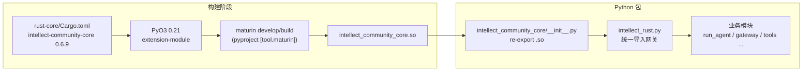
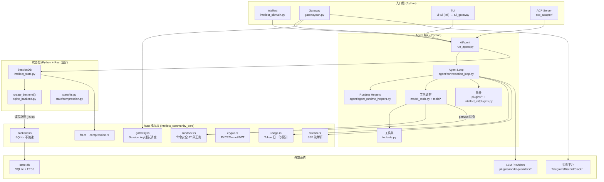

# Intellect Agent：Rust ↔ Python 架构梳理

> 文档日期：2026-09-14（上一版 2026-07-08）  
> 适用版本：Python `intellect-agent` 0.6.9 / Rust `intellect-community-core` 0.6.9

## 1. 总体定位

Intellect Agent 是一个 **Python 为主进程、Rust 为性能/安全核心** 的混合架构项目。Python 层负责 CLI/TUI、工具编排、Gateway 平台适配、插件系统等（约 270+ 工具模块）；Rust 层通过 **PyO3 + maturin** 编译为原生扩展 `intellect_community_core`，承担存储加速、沙箱检测、加密、流式解析、Gateway 调度等热路径。

相关文档：

- 迁移路线图（已归档）：`docs/plans/archive/2026-06-18-archived-rust-migration-plan.md`
- v0.6.2 Breaking Change 说明：`RELEASE_v0.6.2.md`
- Rust 模块 README：`rust-core/README.md`
- 跨平台打包设计：`docs/packaging/design.md`
- Gitee Release 与 Native 包：`docs/packaging/gitee-releases.md`
- Docker 版本标签：`docs/packaging/docker.md`

---

## 2. 版本关系

| 维度 | Python | Rust |
|------|--------|------|
| **包名** | `intellect-agent` | `intellect-community-core` (Cargo) |
| **当前版本** | `0.6.9` (`pyproject.toml`) | `0.6.9` (`rust-core/Cargo.toml`) |
| **版本是否绑定** | **是（发布对齐）** — Python 与 Rust crate 版本号同步发布；逻辑耦合仍通过 API 契约 |
| **Python 模块名** | — | `intellect_community_core` (编译产物 `.so`/`.pyd`) |
| **Python 版本要求** | `>=3.12` | 由 PyO3 0.21 决定，CI 中在 3.11/3.12 上测试 |
| **构建方式** | `pip install -e .` / `uv sync` | **单独** `maturin develop --release` |
| **pip 是否自动编译 Rust** | **否** — setuptools 只装 Python 包 |

### 版本交互模型

```
intellect-agent 0.6.x          intellect-community-core 0.6.x
        │                                    │
        │  逻辑耦合（API 契约）               │
        └──────────────┬─────────────────────┘
                       │
              maturin develop / build
                       │
              import intellect_community_core
```

**关键结论：**

- **发布版本对齐**：Python 与 Rust crate 同步 semver（当前 `0.6.9`）；二者通过 **函数/类 API 契约** 耦合。
- **运行时依赖（v0.6.2+）**：Rust 扩展从「可选加速」变为 **硬性依赖**（见 `RELEASE_v0.6.2.md`）。缺少扩展时，各模块在调用 Rust 函数时会直接失败，不再走 Python 回退。
- **构建与安装分离**：`pyproject.toml` 的构建后端是 setuptools，**不会**自动编译 Rust；`[tool.maturin]` 只声明 manifest/module-name，供 maturin 定位。v0.6.2 起运行必须手动构建：

  ```bash
  pip install maturin
  cd rust-core && maturin develop --release
  ```

- **CI 验证**：`.github/workflows/rust-ci.yml`（镜像 `.gitee/workflows/rust-ci.yml`）跑 `cargo test`（pure + extension-module 两种模式）、`cargo deny check`（`deny.toml` 供应链策略），并断言 Rust 单测数 ≥ 84；`.github/workflows/tests.yml` 另有一个 `rust` job 作快速门禁。

---

## 3. 绑定与集成机制

### 3.1 构建链路


```mermaid
flowchart LR
    subgraph Build["构建阶段"]
        Cargo["rust-core/Cargo.toml\nintellect-community-core 0.6.9"]
        PyO3["PyO3 0.21\nextension-module"]
        Maturin["maturin develop/build\n(pyproject [tool.maturin])"]
        SO["intellect_community_core.so"]
    end

    subgraph PythonPkg["Python 包"]
        Init["intellect_community_core/__init__.py\nre-export .so"]
        Gate["intellect_rust.py\n统一导入网关"]
        App["业务模块\nrun_agent / gateway / tools ..."]
    end

    Cargo --> PyO3 --> Maturin --> SO
    SO --> Init --> Gate --> App
```

**构建配置要点：**

| 文件 | 作用 |
|------|------|
| `rust-core/Cargo.toml` | Rust crate 定义，`crate-type = ["cdylib", "rlib"]` |
| `pyproject.toml` `[tool.maturin]` | 指定 `manifest`、`module-name`、`python-source` |
| `intellect_community_core/__init__.py` | 从编译产物 re-export 所有符号 |
| `Makefile` | `make rust-build` / `make rust-dev` 快捷目标 |

### 3.2 统一适配层 `intellect_rust.py`

所有 Rust 调用 **集中经过** 这一模块，避免在各处散落 `try/import`：

```python
def _load_core():
    """Import the native extension, or None if unavailable."""
    try:
        import intellect_community_core as core
        getattr(core, "detect_hardline_command_rs")  # 符号探测：过期构建也会被判为不可用
        return core
    except (ImportError, AttributeError, ModuleNotFoundError):
        return None

def ensure_rust_available() -> None:
    """启动时调用：缺失扩展就 fail fast，不退化为 Python 回退。"""
    if not _has():
        raise RuntimeError(
            "The intellect_community_core Rust extension is not installed. "
            "Build it with: cd rust-core && maturin develop --release"
        )
```

约定：导出的 Python 名统一加 `rust_` 前缀，绑定的扩展符号保留 `*_rs` 后缀（`rust_paths_overlap` ← `paths_overlap_rs`）；类名直接沿用（`SQLiteBackend`、`StreamAccumulator`、`IterationBudget`、`DelegationRegistry` 等），`FailoverReason`/`ClassifiedError` 以 `RustFailoverReason`/`RustClassifiedError` 别名导出避免与 Python 同名类冲突。完整名单见 `rust-core/README.md` 的 Runtime Integration 表。

### 3.3 Rust 模块导出（`rust-core/src/lib.rs`）

Python 模块名：`import intellect_community_core`

| 阶段 | Rust 源文件 | 导出内容 |
|------|-------------|----------|
| Stage 1b | `fts.rs`, `compression.rs` | FTS5 触发器/索引工具、压缩链 CTE |
| Stage 1c | `backend.rs`, `connection.rs` | `SQLiteBackend`、`RustConnection` / `RustCursor` / `RustRow` |
| Stage 2 | `sandbox.rs` | 命令检测（hardline / dangerous）、sudo stdin 守卫、路径与 IP 检查 |
| Stage 3 | `usage.rs`, `stream.rs` | `TokenAccumulator`、`StreamAccumulator`、`normalize_usage_rs`、用量/时长格式化 |
| Stage 4 | `gateway.rs`, `delegation.rs` | Session key、重置策略、批量过期与退避、`TokenBucket`、`PlatformRetryScheduler`、`DelegationRegistry` |
| Stage 5 | `crypto.rs` | PKCE、Fernet、安全随机、JWT claims |
| Phase 1 | `counters.rs` | `IterationBudget`、`jittered_backoff_rs` |
| Phase 3 | `error_classifier.rs` | `FailoverReason`、`ClassifiedError`、`classify_api_error_rs` |
| Phase 4 | `sanitize.rs` | surrogate / 非 ASCII 剥离、JSON 控制字符转义、tool 参数修复 |
| Phase 5 / M2 | `tokens.rs` | token 估算、Grok allowlist、provider 前缀剥离、模型名匹配、context 探测档位、CJK 检测 |
| M5-M9 | `prompt_caching.rs`, `tool_utils.rs` | cache_control 断点、`file_mutation_result_landed`、`canonical_tool_args`、YAML frontmatter、`paths_overlap` |
| HP-303 | `verification.rs` | 验证证据表读写 + 命令分类（fail-open） |
| HP-304 | `blueprints.rs` | Blueprint YAML / 参数校验 |
| HP-402 | `merge_queue.rs` | `append_message_batch_rs` 批量写合并 |
| — | `schema.rs` | FTS 标识符白名单；**仅 Rust 内部使用，未注册到 Python** |

当前向 Python 注册 **59 个函数 + 12 个类**（以 `rust-core/src/lib.rs` 为准）；
`schema.rs` 是唯一编译进来但不暴露给 Python 的模块。

---

## 4. 系统结构总览


```mermaid
flowchart TB
    subgraph Entry["入口层 (Python)"]
        CLI["intellect\nintellect_cli/main.py"]
        GW["Gateway\ngateway/run.py"]
        TUI["TUI\nui-tui (Ink) ↔ tui_gateway"]
        ACP["ACP Server\nacp_adapter/"]
    end

    subgraph Core["Agent 核心 (Python)"]
        RA["AIAgent\nrun_agent.py"]
        CV["Agent Loop\nagent/conversation_loop.py"]
        AR["Runtime Helpers\nagent/agent_runtime_helpers.py"]
        MT["工具编排\nmodel_tools.py + tools/*"]
        TS["工具集\ntoolsets.py"]
        PL["插件\nplugins/* + intellect_cli/plugins.py"]
    end

    subgraph State["状态层 (Python + Rust 混合)"]
        SS["SessionDB\nintellect_state.py"]
        SB["create_backend()\nsqlite_backend.py"]
        FTS["state/fts.py\nstate/compression.py"]
    end

    subgraph RustCore["Rust 核心层 (intellect_community_core)"]
        BE["backend.rs\nSQLite 写加速"]
        SBX["sandbox.rs\n命令安全 87 条正则"]
        USG["usage.rs\nToken 归一化/累计"]
        STR["stream.rs\nSSE 流解析"]
        CRY["crypto.rs\nPKCE/Fernet/JWT"]
        GWT["gateway.rs\nSession key/重试调度"]
        FTSR["fts.rs + compression.rs"]
    end

    subgraph External["外部系统"]
        LLM["LLM Providers\nplugins/model-providers/*"]
        Plat["消息平台\nTelegram/Discord/Slack/..."]
        DB["state.db\nSQLite + FTS5"]
    end

    CLI --> RA
    GW --> RA
    TUI --> RA
    ACP --> RA

    RA --> CV
    CV --> AR
    CV --> MT --> TS
    CV --> PL
    RA --> SS
    SS --> SB

    SB -->|"读写路径 (Rust)"| BE
    BE --> DB

    MT --> SBX
    MT -->|"path/url 检查"| SBX

    CV --> USG
    CV --> STR
    GW --> GWT
    SS --> FTSR

    CV --> LLM
    GW --> Plat
```

### 入口点

| 命令 | 模块 | 说明 |
|------|------|------|
| `intellect` | `intellect_cli/main.py` | 交互式 CLI / 子命令分发 |
| `intellect-agent` | `run_agent.py` | Agent 库入口 |
| `intellect-acp` | `acp_adapter/entry.py` | 编辑器 ACP 集成 |
| `intellect --tui` | `ui-tui/` + `tui_gateway/` | Ink TUI + JSON-RPC 后端 |
| `intellect gateway` | `gateway/run.py` | 消息 Gateway |

---

## 5. Rust ↔ Python 按域交互表

| 域 | Rust 模块 | Python 消费方 | 交互方式 |
|----|-----------|---------------|----------|
| **存储** | `backend.rs`, `connection.rs` | `agent/storage/sqlite_backend.py` → `intellect_state.py` | **统一模式**：Rust `SQLiteBackend` 负责全部读写；`SESSIONDB_USE_RUST_RW = 1`（当前默认）启用 Rust 全读写，`= 0` 回退 Python sqlite3 |
| **会话批写** | `merge_queue.rs` | `agent/storage/sqlite_backend.py` | `append_message_batch_rs` 合并为单事务（HP-402） |
| **FTS/压缩** | `fts.rs`, `compression.rs` | `state/fts.py`, `state/compression.py` | 函数调用 |
| **沙箱** | `sandbox.rs` (87 条正则) | `tools/approval.py` | 命令归一化后调用 `detect_*_rs`；AST 层仍在 Python |
| **路径/URL 安全** | `sandbox.rs` | `tools/path_security.py`, `tools/url_safety.py` | 直接调用 |
| **Token 用量** | `usage.rs` | `run_agent.py`, `agent/usage_pricing.py` | `TokenAccumulator` 类 + `normalize_usage_rs` |
| **流式响应** | `stream.rs` | `agent/chat_completion_helpers.py` | `StreamAccumulator` 累积 SSE delta |
| **加密/OAuth** | `crypto.rs` | `agent/oauth/*`, `agent/secret_store.py` | PKCE、Fernet 加解密 |
| **Gateway** | `gateway.rs` | `gateway/session.py` | Session key 构建、批量过期检查、`PlatformRetryScheduler` |
| **后台委派** | `delegation.rs` | `tools/async_delegation.py`, `tools/delegation_persistence.py` | `DelegationRegistry` 句柄跟踪 + 完成队列 |
| **错误分类** | `error_classifier.rs` | `agent/error_classifier.py` | `classify_api_error_rs` + `FailoverReason`/`ClassifiedError` |
| **消息净化** | `sanitize.rs` | `agent/message_sanitization.py` | 纯字符串函数（列表/字典就地修改仍在 Python） |
| **模型元数据** | `tokens.rs` | `agent/model_metadata.py` | 估算、前缀剥离、探测档位、CJK 检测 |
| **迭代预算/退避** | `counters.rs` | `agent/iteration_budget.py`, `agent/retry_utils.py`, `agent/conversation_loop.py`, `agent/agent_init.py`, `run_agent.py` | `IterationBudget` 类 + `jittered_backoff_rs` |
| **Prompt 缓存** | `prompt_caching.rs` | `agent/prompt_caching.py` | `rust_apply_cache_control` |
| **工具辅助** | `tool_utils.rs` | `agent/tool_result_classification.py`, `agent/tool_guardrails.py`, `agent/prompt_builder.py`, `agent/tool_dispatch_helpers.py`, `tools/skill_manager_tool.py` | 纯计算函数 |
| **验证证据** | `verification.rs` | `agent/verification_evidence.py` | 证据表读写 + 命令分类，全部 fail-open（HP-303） |
| **Blueprint** | `blueprints.rs` | `tools/blueprints.py`, `cron/blueprint_catalog.py` | YAML / 参数校验（HP-304） |

### 典型调用链

**命令审批（沙箱）：**

```
terminal 工具 → approval.py
  → _normalize_command_for_detection()
  → rust_detect_hardline / rust_detect_dangerous  (Rust regex)
  → 批准/拒绝
```

**Session 存储（统一 Rust 读写，Python 可回退）：**

```
SessionDB → create_backend() → RustSQLiteBackend
  ├── SESSIONDB_USE_RUST_RW=1: _backend (Rust) → execute_write + connection()
  │     ├── 写：Rust execute_write (BEGIN IMMEDIATE/COMMIT/retry)
  │     └── 读：独立 Rust read_conn (WAL 模式，不阻塞写 Mutex)
  └── SESSIONDB_USE_RUST_RW=0: _python_conn (Python sqlite3) → 全读写
```

**Agent 对话循环：**

```
run_agent.py → chat_completion_helpers.py
  ├── StreamAccumulator (Rust)  ← SSE 流
  ├── TokenAccumulator (Rust)   ← 用量统计
  └── handle_function_call()    ← 工具执行仍在 Python
```

### Python 消费方完整列表

| Python 模块 | 导入的 Rust 符号 |
|-------------|-----------------|
| `agent/storage/sqlite_backend.py` | `SQLiteBackend` |
| `state/fts.py` | `rust_is_fts5_unavailable_error`, `rust_drop_fts_triggers`, … |
| `state/compression.py` | `rust_get_compression_tip` |
| `tools/approval.py` | `rust_detect_hardline`, `rust_detect_dangerous`, `rust_check_sudo_stdin` |
| `tools/path_security.py` | `rust_is_forbidden_path` |
| `tools/url_safety.py` | `rust_is_ip_blocked` |
| `agent/usage_pricing.py` | `rust_normalize_usage` |
| `run_agent.py` | `TokenAccumulator` |
| `agent/chat_completion_helpers.py` | `StreamAccumulator` |
| `agent/oauth/__init__.py` | `rust_pkce_challenge`, `rust_secure_hex` |
| `agent/oauth/storage.py` | `rust_fernet_encrypt`, `rust_fernet_decrypt` |
| `agent/secret_store.py` | `rust_fernet_encrypt`, `rust_fernet_decrypt` |
| `gateway/session.py` | `PlatformRetryScheduler`, `rust_build_session_key`, `rust_check_expiry_batch` |
| `agent/prompt_caching.py` | `rust_apply_cache_control` |
| `agent/tool_result_classification.py` | `rust_file_mutation_landed` |
| `agent/tool_guardrails.py` | `rust_canonical_tool_args` |
| `agent/prompt_builder.py` | `rust_strip_yaml_frontmatter`, `rust_truncate_content` |
| `agent/tool_dispatch_helpers.py` | `rust_paths_overlap` |
| `tools/skill_manager_tool.py` | `rust_validate_skill_frontmatter` |
| `agent/message_sanitization.py` | `rust_sanitize_surrogates`, `rust_strip_non_ascii`, `rust_repair_tool_args`, `rust_escape_json_chars` |
| `agent/model_metadata.py` | `rust_estimate_tokens_rough`, `rust_grok_supports_re`, `rust_strip_provider_prefix`, `rust_get_next_probe_tier`, `rust_model_name_suggests_kimi`, `rust_model_id_matches`, `rust_normalize_model_version` |
| `agent/error_classifier.py` | `rust_classify_api_error`, `RustFailoverReason`, `RustClassifiedError` |
| `agent/iteration_budget.py`, `agent/conversation_loop.py`, `agent/agent_init.py`, `run_agent.py` | `IterationBudget` |
| `agent/retry_utils.py` | `rust_jittered_backoff` |
| `agent/verification_evidence.py` | `rust_insert_verification_evidence`, `rust_query_verification_evidence`, `rust_classify_verification_command` |
| `tools/blueprints.py`, `cron/blueprint_catalog.py` | `rust_validate_blueprint_params`, `rust_validate_blueprint_yaml` |
| `tools/async_delegation.py`, `tools/delegation_persistence.py` | `DelegationRegistry` |
| `agent/storage/sqlite_backend.py` | `SQLiteBackend`, `rust_append_message_batch` |
| `intellect_state.py` | `search_messages` (Rust FTS5 fast path: 非 CJK) |

---

## 6. 仍在 Python 的部分（Rust 未迁移）

截至 2026-09-14，Rust crate 共 **8,141 行**（21 个源文件，20 个模块注册到 Python）。下表的行数按当前
`agent/*.py` 实测（上一版数据取自 2026-06-20，已大幅漂移）。

M16（SessionDB 读写统一）已完成：`SESSIONDB_USE_RUST_RW = 1` 默认启用，全部读写经 Rust rusqlite。

2026-07-08 之后新增的迁移波次：

- **Phase 1** `counters.rs` — `IterationBudget`、`jittered_backoff_rs`
- **Phase 3** `error_classifier.rs` — `classify_api_error_rs`（Python 侧 `agent/error_classifier.py` 从 1,316 行缩到 162 行）
- **Phase 4** `sanitize.rs` — 纯字符串净化函数
- **Phase 5 / M2** `tokens.rs` — token 估算、模型名前缀/别名、CJK 检测
- **HP-303/304/402** — `verification.rs`、`blueprints.rs`、`merge_queue.rs`
- `search_messages` 非 CJK FTS5 路径委托 Rust `backend.rs` 执行

M5 仍未启动（`context_compressor` 核心算法），M7 跳过（`tool_executor` 深度耦合 Python agent 状态）。

### 6.1 Agent Loop 核心（4,740 行）— 最大未迁移块

**`agent/conversation_loop.py`** — `run_conversation()` 函数（原为 `run_agent.py` 内联代码，v0.6.x 提取）：

| 子系统 | 描述 | Rust 迁移难度 |
|---|---|---|
| Turn 初始化 | Session 创建、状态重置、preflight 上下文压缩 | 中（纯状态管理） |
| 工具调用 while 循环 | 迭代预算管理、中断检测、step_callback | 高（深度耦合 Python 对象模型） |
| API 消息构建管线 | Content 注入、prefix 规范化、Anthropic cache markers、role alternation 修复、reasoning echo-back | 中（纯数据变换） |
| HTTP 重试循环 | 指数退避、中断感知、fallback provider 切换、OntoWeb rate limit guard | 高（依赖 Python HTTP client） |
| 4 种响应校验路径 | Anthropic / Codex Responses / Bedrock / Chat Completions 各自的 `validate_response` | 中（模式匹配） |
| 9 种错误恢复路径 | UnicodeEncodeError、ASCII codec、image rejection、context overflow、429 rate limit、billing、auth token 过期、OAuth、llama.cpp grammar | 高（每一路径需维护 provider 特化规则） |
| finish_reason 处理 | Length 截断（3 次 continuation 重试）、truncated tool call 检测、thinking-budget exhaustion 检测 | 中（状态机逻辑） |
| Assistant 响应处理 | Content 规范化、reasoning 提取、tool call 校验（名称修复 + JSON 修复） | 低（纯数据校验） |
| 空响应恢复管线 | thinking-only prefill → post-tool-call empty nudge → fallback provider → "(empty)" terminal | 中（状态机） |
| Post-turn hooks | 文件变更验证 footer、completion explainer、trajectory 保存、session 持久化、plugin hooks | 低（格式化逻辑） |
| 会话管理 | System prompt 缓存/恢复、token 用量同步、turn-exit 诊断日志 | 低（DB 操作已在 Rust） |
| Steer 注入/排空 | `/steer` 指令在中途 drain 到 tool result 或 user message | 低（字符串注入） |
| 背景 review 触发 | Memory/skill nudge 计数器、后台 fork 启动 | 低（调度逻辑） |

### 6.2 大型辅助模块（各 1,000-5,720 行）

| 文件 | 行数 | 功能 | Rust 迁移难度 |
|---|---|---|---|
| `agent/auxiliary_client.py` | 5,720 | 辅助 LLM 客户端（compression 用的 side model、vision 等） | 高（深度依赖 Python LLM SDK） |
| `agent/context_compressor.py` | 2,815 | 有损摘要压缩算法、阈值判定、anti-thrash 保护 | 中（纯算法逻辑，但依赖 `auxiliary_client`） |
| `agent/chat_completion_helpers.py` | 2,691 | 流式响应处理、响应规范化、`_handle_max_iterations` | 中（`StreamAccumulator` 已在 Rust） |
| `agent/agent_runtime_helpers.py` | 2,462 | Tool 调度（`invoke_tool`）、模型切换、credential pool 恢复、API client 创建 | 高（依赖 Python 对象模型） |
| `agent/model_metadata.py` | 1,769 | Token 估算、context length 探测、模型能力检测 | 低（纯计算部分已迁 `tokens.rs`，余下收益有限） |
| `agent/prompt_builder.py` | 1,507 | System prompt 构建（memory、skills、context files 拼接） | 低（YAML frontmatter / 截断已迁 `tool_utils.rs`） |
| `agent/tool_executor.py` | 1,200 | 并发/顺序工具执行、`ThreadPoolExecutor`、loop 检测 | 中（M7 已判定跳过：GIL 释放 + 线程安全） |
| `agent/display.py` | 1,033 | `KawaiiSpinner` 动画、状态显示 | 低（纯 UI，迁移 Rust 意义不大） |

### 6.3 中型模块（400-899 行）

| 文件 | 行数 | 功能 |
|---|---|---|
| `agent/usage_pricing.py` | 867 | 按模型/provider 成本估算（用量归一化已在 Rust，成本查找表仍在 Python） |
| `agent/tool_guardrails.py` | 664 | `ToolLoopGuardrail` 类、loop 检测模式匹配（纯函数部分已迁 `tool_utils.rs`） |
| `agent/memory_manager.py` | 640 | 外部 memory provider 管理、prefetch、sync |
| `agent/background_review.py` | 597 | 后台 memory/skill review fork（独立 agent 实例） |
| `agent/codex_runtime.py` | 535 | Codex app-server API 模式的独立 event loop |
| `agent/system_prompt.py` | 500 | System prompt 构建辅助函数 |
| `agent/tool_dispatch_helpers.py` | 478 | Tool 结果格式化、共享辅助（`paths_overlap` 已迁 Rust） |

### 6.4 小型模块（< 420 行）

| 文件 | 行数 | 功能 |
|---|---|---|
| `agent/message_sanitization.py` | 350 | Surrogate 剥离、非 ASCII 剥离、图片剥离、tool call 参数修复（纯字符串部分已迁 `sanitize.rs`） |
| `agent/context_engine.py` | 226 | 可插拔上下文管理 ABC |
| `agent/process_bootstrap.py` | 167 | `_install_safe_stdio()` — broken pipe 防护 |
| `agent/error_classifier.py` | 162 | `classify_api_error()` 的 Python 外壳（分类主体已迁 `error_classifier.rs`） |
| `agent/trajectory.py` | 56 | `has_incomplete_scratchpad()` 检测 |
| `agent/retry_utils.py` | 39 | `jittered_backoff()` 转调 Rust |
| `agent/prompt_caching.py` | 27 | Anthropic `cache_control` breakpoint markers — 转调 Rust |
| `agent/tool_result_classification.py` | 21 | Tool 结果分类 — 转调 Rust |
| `agent/iteration_budget.py` | 20 | 原子计数器 — 转调 Rust |

### 6.5 始终保留在 Python 的领域（迁移无意义）

- **工具实现**（`tools/*`，93 个 Python 模块）及 MCP 集成 — 工具实现本身就是 Python 生态优势
- **CLI/TUI** (`cli.py`, `ui-tui/`, `tui_gateway/`) — 终端交互
- **Gateway 平台适配器** (`gateway/platforms/*`) — Telegram/Discord/Slack/Feishu 等 I/O 密集型
- **插件系统** (`plugins/*`, model-providers, memory providers) — 需 Python 动态加载
- **ACP Server** (`acp_adapter/`) — 编辑器集成

### 6.6 迁移优先级（2026-09-14 复核）

**已完成** —— 上一版列出的高优先级 1-5 项全部落地：

| 原目标 | 落点 |
|---|---|
| `model_metadata.py` | `tokens.rs`（Phase 5 / M2） |
| `error_classifier.py` | `error_classifier.rs`（1,316 → 162 行） |
| `message_sanitization.py` | `sanitize.rs`（Phase 4） |
| `iteration_budget.py` + `retry_utils.py` | `counters.rs`（Phase 1） |
| `usage_pricing.py` 用量归一化 | `usage.rs`（成本查找表仍在 Python） |

**已明确关闭 —— 有实测结论，勿重复尝试**（依据 `docs/plans/bench-baseline.json`，摘要见 `rust-core/README.md`）：

- **G-14 `list_sessions_rich`**：SQL 已在 SQLite C 层执行，迁移只能回收约 8% 的 Python 组装成本，却要付 FFI row/dict 重建开销。真正的杠杆是 SQL 形态本身。
- **G-21 `stream_consumer`**：Python 热路径实测 24.96 MB/s（p50 15.96 µs/delta），真实网关负载下 CPU 占比 0.036%；瓶颈是平台 edit API（秒级、限速主导）。

**仍可考虑**（收益未验证，动手前先 benchmark）：

- `context_compressor.py` — 摘要算法可迁，但受 `auxiliary_client` 依赖牵制（M5 未启动）
- `tool_guardrails.py` — 纯模式匹配部分已迁 `tool_utils.rs`；阈值配置保持 Python 可配

**不建议迁移**：`conversation_loop.py`（核心 loop 深度依赖 Python 对象模型）、`auxiliary_client.py`（依赖 Python LLM SDK）、`display.py`（终端 UI）、`tool_executor.py`（M7 已跳过）。

---

## 7. 架构演进状态


```mermaid
timeline
    title Rust 迁移进度
    section 已完成 (v0.6.2–0.6.5)
        Stage 1 存储加速 : SQLiteBackend / FTS / compression / connection
        Stage 2 沙箱 : 87 条 regex + Python AST 双层防御 + path/url 检查
        Stage 3 部分 : TokenAccumulator / StreamAccumulator / normalize_usage
        Stage 4 部分 : session key / retry scheduler / batch expiry / backoff
        Stage 5 部分 : PKCE / Fernet / JWT decode / secure random
    section 已完成 (Phase 1-5 / M2 / HP-303-402)
        Error Classifier : classify_api_error_rs + FailoverReason → Rust
        Sanitizer : surrogate / 非 ASCII / JSON 转义 / tool 参数修复 → Rust
        Counters : IterationBudget + jittered backoff → Rust
        Model Metadata : token 估算 / 前缀剥离 / 探测档位 / CJK → Rust
        Verification : 证据表读写 + 命令分类 → Rust (HP-303)
        Blueprints : YAML / 参数校验 → Rust (HP-304)
        Merge Queue : append_message 批量合并 → Rust (HP-402)
    section 部分完成 (M5-M9)
        Prompt Caching : cache_control breakpoint 策略 → Rust
        Prompt Builder : strip_yaml_frontmatter, truncate_content → Rust
        Tool Guardrails : canonical_tool_args, file_mutation_landed → Rust
        Tool Dispatch : paths_overlap → Rust
        Context Compressor : 核心算法 (延迟 / M5 未启动)
        Tool Executor : 不可迁 (深度耦合 Python agent / M7 跳过)
    section 实测关闭
        list_sessions_rich : G-14 — 迁移只能回收 ~8% Python 组装成本
        stream_consumer : G-21 — 真实负载 CPU 占比 0.036%
    section 未开始
        Agent Loop 核心 : conversation_loop.py — 4,740 行，全部在 Python
        Gateway Event Loop : tokio 事件循环 (Rust 仅提供工具函数)
    section 可选 (长期)
        Stage 6 : Rust 主进程 intellectd + 内嵌 Python
```

### 7.1 迁移统计数据

| 分类 | 文件数 | 总行数 | 迁移率 |
|------|--------|--------|--------|
| Rust (已迁移) | 21 | 8,141 | — |
| SessionDB 读写 | — | — | **100%**（`SESSIONDB_USE_RUST_RW = 1`） |
| SessionDB 搜索 | — | — | **非 CJK 100%**（Rust FTS5 fast-path） |
| Agent Loop 核心 | 1 | 4,740 | 0% |
| 大型辅助 (≥1,000 行) | 8 | 19,197 | 部分（`StreamAccumulator`、`TokenAccumulator`） |
| 中型辅助 (400-999 行) | 7 | 4,281 | 部分（`usage_pricing` 归一化、`model_metadata`、`tool_guardrails` 纯函数、`tool_dispatch_helpers`） |
| 小型辅助 (<400 行) | 9 | 1,068 | 部分（`iteration_budget`、`retry_utils`、`error_classifier`、`message_sanitization`、`prompt_caching`） |
| **Python 小计（§6 列出的全部文件）** | **25** | **29,286** | — |
| Rust ÷ (Rust + 本表 Python) | — | — | **≈21.8%**（粗糙口径，仅供趋势参考） |

行数为 2026-09-14 用 `wc -l` 实测；`迁移率` 一列只统计上表列出的 agent 侧文件，
不含 `tools/`、`gateway/`、`webui/` 等仍整体留在 Python 的部分。

---

## 8. 开发/部署注意事项

1. **开发环境**：`make rust-build` 或 `cd rust-core && maturin develop --release`，再 `pip install -e .`
2. **测试**：
   - 主测试 suite：`scripts/run_tests.sh`
   - Rust 单元测试：`cd rust-core && cargo test --no-default-features`（不需要链接 CPython，CI 快速门禁用这条）
   - Rust/Python parity：`scripts/run_tests.sh tests/intellect_state/test_rust_parity.py`
   - 扩展握手（构建版本、过期 .so 检测）：`tests/test_community_core_handshake.py`
3. **纯 Python 安装已废弃**：`make install-pure` 仍存在，但 v0.6.2+ 运行时会因缺少 Rust 扩展而失败
4. **读写模式**：
   - `intellect_state.py` 中 `SESSIONDB_USE_RUST_RW = 1`（**当前默认**）—— 全部读写走 Rust rusqlite（独立读连接，WAL 模式）
   - 设为 `0` 回退 Python sqlite3；`agent/storage/sqlite_backend.py` 会读这个常量决定分流
   - 注：该常量上方的注释块仍写着 "0 = ...（safe default）"，与赋值不符，属注释漂移

### Rust 依赖（Cargo.toml）

```toml
pyo3 = "0.21"            # Python bindings（default feature: extension-module）
rusqlite = "0.31"        # SQLite (bundled, FTS5 included)
regex = "1"              # 命令安全正则
serde + serde_json = "1" # 序列化
serde_yaml = "0.9"       # Blueprint YAML（HP-304）
sha2, base64, hex        # 哈希/编码
aes, cbc, hmac, pbkdf2   # Fernet 加密
rand = "0.8"             # CSPRNG
```

供应链策略见 `rust-core/deny.toml`（`cargo deny check`，CI 中执行）。

---

## 9. 小结

Intellect Agent 采用 **「Python 编排 + Rust 热路径加速」** 的 PyO3 嵌入式架构：

| 维度 | 说明 |
|------|------|
| **版本** | Python 与 Rust crate **同步编号**（当前 `0.6.9`），通过 API 契约耦合 |
| **构建** | maturin 单独编译，不随 `pip install` 自动完成 |
| **运行** | v0.6.2 起 Rust 为 **硬性依赖**，经 `intellect_rust.py` 统一接入 |
| **已迁移** | 存储读写与批写、沙箱安全检测、流解析、Token 累计、加密、Gateway 调度、错误分类、消息净化、模型元数据、迭代预算、验证证据、Blueprint、委派注册表 — 共 8,141 行 / 21 个源文件 |
| **未迁移** | Agent Loop 核心（4,740 行）、Auxiliary Client（5,720）、Context Compressor（2,815）、Chat Completion Helpers（2,691）、Agent Runtime Helpers（2,462）、Tool Executor（1,200）、Display（1,033）等 — §6 所列共 25 个文件 / 29,286 行 Python |
| **迁移率** | 约 **21.8%**（8,141 ÷ (8,141 + 29,286)，仅计 §6 列出的 agent 侧文件） |
| **边界** | 工具执行、Gateway 平台 I/O、插件、Memory 仍在 Python；存储、安全检测、加密、流解析、Gateway 调度、错误分类与各类纯计算逻辑在 Rust |
