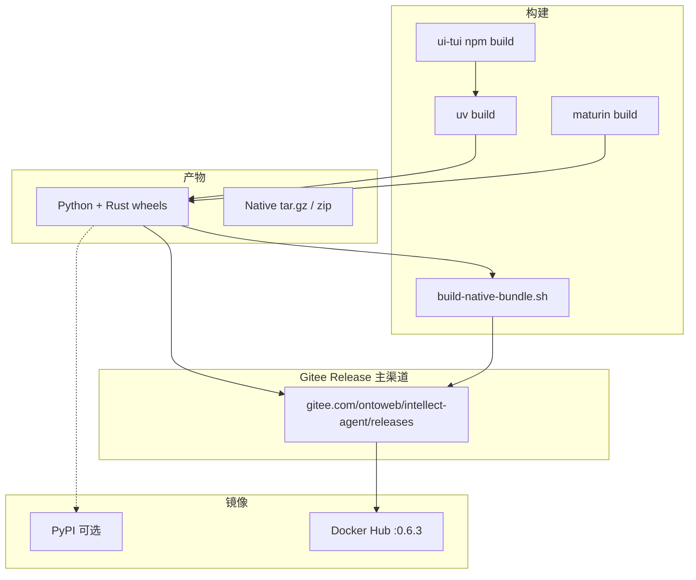

# 跨平台打包设计

> 文档日期：2026-06-16  
> 适用版本：Python `0.6.3` / Rust crate `0.1.0`

## 1. 背景与约束

自 **v0.6.2** 起，`intellect_community_core` Rust 扩展为**运行时硬性依赖**（见 `RELEASE_v0.6.2.md`）。当前发布链路存在缺口：

- PyPI 仅发布 Python `intellect-agent` wheel/sdist，**不含** Rust 扩展
- `scripts/install.sh` / `install.ps1` clone 后 **未** 调用 maturin
- Docker 镜像 **未** 编译 Rust
- Homebrew formula **未** 声明 Rust 构建步骤

本设计定义三平台（Windows / Linux / macOS）的统一打包模型，使正式渠道用户**无需本地安装 Rust 工具链**。

架构背景见 [`docs/architecture/rust-python-interaction.md`](../architecture/rust-python-interaction.md)。

---

## 2. 设计原则

1. **Gitee 为主渠道**：源码、Release 附件、Native 包均发布在 Gitee；PyPI / Docker Hub 为镜像
2. **双包模型**：Python 包 `intellect-agent` + Rust 包 `intellect-community-core`，通过版本 pin 耦合
3. **Native 预编译优先**：三平台提供 tar.gz / zip 自包含包（venv + wheel），用户无需 Rust 工具链
4. **平台 wheel 矩阵**：Linux / macOS / Windows 各架构独立 manylinux/macosx/win wheel，上传 Gitee Release
5. **安装脚本兜底**：`install.sh` / `install.ps1` 优先从 Gitee Release 下载 wheel 或 Native 包
6. **Docker 版本化**：镜像打 SemVer（`:0.6.3`）与 CalVer（`:v2026.6.16`）双标签
7. **单一构建脚本**：`packaging/scripts/build-release-artifacts.sh` + `build-native-bundle.sh`

---

## 3. 产物矩阵

### 3.1 Python 包 `intellect-agent`

| 属性 | 值 |
|------|-----|
| 构建 | `uv build --sdist --wheel` |
| Wheel 类型 | `py3-none-any`（纯 Python + 打包资源） |
| 内含 | agent、tools、gateway、plugins、skills、TUI bundle、install 脚本 |
| 入口 | `intellect`, `intellect-agent`, `intellect-acp` |

### 3.2 Rust 包 `intellect-community-core`

| 属性 | 值 |
|------|-----|
| 构建 | `cd rust-core && maturin build --release` |
| Python 导入名 | `intellect_community_core` |
| Wheel 类型 | **平台相关**（含 `.so` / `.pyd` / `.dylib`） |

### 3.3 目标平台 wheel 标签

| 平台 | Wheel tag | CI runner | 优先级 |
|------|-----------|-----------|--------|
| Linux x86_64 | `manylinux_2_28_x86_64` | `ubuntu-22.04` | P0 |
| Linux arm64 | `manylinux_2_28_aarch64` | `ubuntu-22.04-arm` | P0 |
| macOS universal2 | `macosx_11_0_universal2` | `macos-14` | P0 |
| macOS x86_64 | `macosx_11_0_x86_64` | `macos-13` | P1（universal2 可覆盖） |
| macOS arm64 | `macosx_11_0_arm64` | `macos-14` | P1 |
| Windows amd64 | `win_amd64` | `windows-latest` | P0 |
| Linux musl | `musllinux_1_2_x86_64` | Alpine container | P2（Alpine 用户） |
| Windows arm64 | `win_arm64` | `windows-11-arm` | P2 |

Python ABI：`cp312`、`cp313`（与 `requires-python >=3.12` 对齐）。

完整清单见 `packaging/manifests/artifacts.yaml`。

---

## 4. 分发渠道设计

**主渠道：Gitee** — 详见 [gitee-releases.md](./gitee-releases.md)  
**Docker 版本策略** — 详见 [docker.md](./docker.md)



### 4.1 Gitee Release（主渠道）

CalVer tag `v2026.6.16` 对应 SemVer `0.6.3`，Release 附件包括：

| 类别 | 文件 |
|------|------|
| Python | `intellect_agent-{semver}.tar.gz`、`*-py3-none-any.whl` |
| Rust wheel | `intellect_community_core-*-{manylinux\|macosx\|win}_*.whl` |
| **Native 包** | `intellect-linux-x86_64-{semver}.tar.gz` 等 |
| 校验 | `SHA256SUMS` |

下载 URL：

```
https://gitee.com/ontoweb/intellect-agent/releases/download/v2026.6.16/{filename}
```

### 4.2 三平台 Native 发布

**可以 Native 发布。** 形态为自包含目录（venv + 预装 wheel + `bin/intellect`），非单一静态二进制。

| 平台 | Native 产物 | 构建脚本 |
|------|-------------|----------|
| Linux x86_64 / arm64 | `.tar.gz` | `build-native-bundle.sh --platform linux` |
| macOS | `.tar.gz` (universal2) | `build-native-bundle.sh --platform darwin` |
| Windows amd64 | `.zip` | `build-native-bundle.sh --platform windows` |

详见 [gitee-releases.md](./gitee-releases.md) §2。

### 4.3 PyPI（可选镜像）

非主渠道；wheel 从 Gitee Release 同步上传。

```bash
pip install intellect-agent   # 依赖 intellect-community-core wheel
```

### 4.4 Git 安装脚本（Gitee clone）

**Linux / macOS** — 从 Gitee clone，优先下载 Release wheel，失败再 maturin 编译：

```
clone (gitee.com) → 尝试 Gitee Release wheel → uv venv → pip install → maturin fallback
```

**Windows** — `install.ps1` 已支持 Gitee zip 下载（commit/tag/branch）。

### 4.5 Docker 版本发布

镜像 `ontoweb/intellect-agent`，Release 时打：

- `:0.6.3`（SemVer，生产推荐）
- `:v2026.6.16`（CalVer）
- `:latest`（仅 main，不推荐生产）

详见 [docker.md](./docker.md)。

### 4.6 Homebrew

更新 `packaging/homebrew/intellect-agent.rb`：

```ruby
depends_on "rust" => :build
depends_on "maturin" => :build  # 或通过 pip in venv

def install
  # ... existing venv setup ...
  system libexec/"bin/pip", "install", "maturin"
  cd buildpath/"rust-core" do
    system libexec/"bin/maturin", "develop", "--release"
  end
  venv.pip_install buildpath
end
```

长期优化：Homebrew 从 Gitee Release 或 PyPI 拉取预编译 Rust wheel。

---

## 5. 版本策略

| 包 | 版本源 | 升级规则 |
|----|--------|----------|
| `intellect-agent` | `pyproject.toml` `[project].version` | semver，随功能发版 |
| `intellect-community-core` | `rust-core/Cargo.toml` `version` | 独立 semver；**API 变更时 bump** |
| 耦合 | `intellect-agent` 依赖 pin | `intellect-community-core==X.Y.Z` 精确 pin |

**规则：**

- Rust API 不变 → Rust crate patch bump 可选；Python 发版时可不改 pin
- Rust 导出符号变更 → Rust minor bump + Python 依赖 pin 同步更新
- 同一 Git tag 下两个包版本写入 Release Notes

---

## 6. CI 流水线设计（目标态）

### Job 1: `build-rust-matrix`

```yaml
strategy:
  matrix:
    include:
      - os: ubuntu-22.04
        target: x86_64-unknown-linux-gnu
      - os: ubuntu-22.04-arm
        target: aarch64-unknown-linux-gnu
      - os: macos-14
        target: universal2-apple-darwin
      - os: windows-latest
        target: x86_64-pc-windows-msvc
steps:
  - uses: actions/setup-python@v6
    with: { python-version: '3.12' }
  - uses: dtolnay/rust-toolchain@stable
  - run: pip install maturin
  - run: cd rust-core && maturin build --release
  - uses: actions/upload-artifact@v4
    with:
      name: rust-wheel-${{ matrix.target }}
      path: rust-core/target/wheels/*.whl
```

### Job 2: `build-python`（现有 upload_to_pypi.yml build job）

- 构建 TUI → bundle → `uv build`
- 附加 `intellect-community-core=={version}` 到 `pyproject.toml` 检查

### Job 3: `publish-pypi`

- 先 upload 全部 Rust wheel
- 再 upload Python wheel/sdist

### Job 4: `upload-gitee-release`

- 合并 artifact → Gitee Release API 上传（替代 `gh release create`）
- 附加 `SHA256SUMS`

### Job 5: `docker-publish`

- 打 `:semver` + `:calver` 标签（见 [docker.md](./docker.md)）

---

## 7. 平台差异摘要

|  | Linux | macOS | Windows |
|--|-------|-------|---------|
| **推荐安装** | `pip install` 或 install.sh | `pip install` 或 install.sh / Homebrew | install.ps1 或 WSL2 |
| **Rust 编译依赖** | gcc, python3-dev | Xcode CLI | MSVC Build Tools |
| **Wheel 标准** | manylinux_2_28 | macosx_11_0_universal2 | win_amd64 |
| **系统工具** | apt/dnf 装 rg/ffmpeg | brew 装 rg/ffmpeg | 安装脚本自动处理 |
| **数据目录** | `~/.intellect/` | `~/.intellect/` | `%LOCALAPPDATA%\intellect\` |
| **Shell 依赖** | 系统 bash | 系统 bash | PortableGit bash |

各平台详细步骤见 [linux.md](./linux.md)、[macos.md](./macos.md)、[windows.md](./windows.md)。

---

## 8. 实施路线图

| 阶段 | 内容 | 状态 |
|------|------|------|
| **P0** | 文档 + 构建脚本 + Gitee Release 规范 | ✅ |
| **P1** | `gitee-release.yml` CI 矩阵 + Gitee 上传 | ✅ |
| **P1** | Docker `:semver` + Dockerfile Rust | ✅ |
| **P2** | `install.sh` / `install.ps1` Gitee wheel | ✅ |
| **P2** | `release.py` + `--gitee-local` | ✅ |
| **P3** | Linux `.deb`、macOS `.pkg`、Gitee 容器镜像 | 待做 |

---

## 9. 验证清单

每次发版前：

```bash
./packaging/scripts/build-release-artifacts.sh
python -c "import intellect_community_core; print('OK')"
intellect version
intellect doctor   # 应报告 Rust 扩展可用
scripts/run_tests.sh tests/intellect_state/test_rust_parity.py -q
```

跨平台 smoke test：

- [ ] `pip install intellect-agent` 后 `import intellect_community_core` 成功
- [ ] `intellect` 启动不报错
- [ ] `tools/approval.py` 沙箱检测可用（`detect_dangerous_command_rs`）
- [ ] Session 读写正常（Rust SQLiteBackend）

完整发版流程见 [maintainer-release.md](./maintainer-release.md)。
