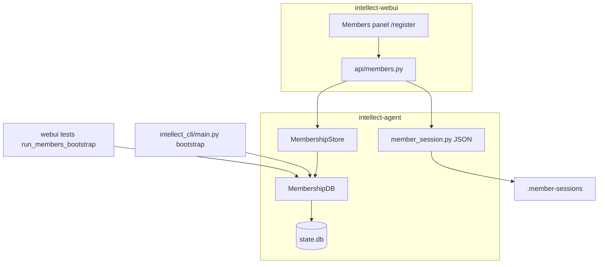

# 成员 / WebUI 加固 — 详细设计方案

**日期：** 2026-06-02  
**状态：** ✅ 已完成 (8/8 + 会话隔离 Phase 1–3)；⏳ **会话隔离 Phase 4（全面加固）** 见 `intellect-webui/docs/plans/session-member-isolation-plan.md`

**最后评估：** 2026-06-03，8 个工作包全部实现 + 会话隔离 Phase 1–3（`list_sessions_rich` / `session_visibility` / WebUI `apply_member_scope`）。2026-06-02 跟进分析：NULL 遗留仍全员可见、写路径/sync/worker/localStorage 等待开发 — 详见 §18 与 WebUI 计划文档。  
**范围：** `intellect-agent`（`agent/membership.py`、`agent/member_session.py`、`intellect_cli/main.py`）+ `intellect-webui`（`api/members.py`、测试）  
**关联：** `webui-collab-review-fix-plan.md`、`member-management-redesign.md`、`intellect-webui/docs/members-oauth-webui.md`、`website/docs/user-guide/features/teams-and-members.md`

---

## 1. 目标与非目标

### 1.1 目标

1. **闭环 WebUI 与 agent 的测试/引导路径**（`run_bootstrap`、fixture 与 `intellect members bootstrap` 行为一致）。
2. ~~**落实 `members.profile_admins`**~~ **已撤销（2026-06）**：审批/邀请仅 **owner/admin** 全局角色；不在 `config.yaml` 维护 login 列表。
3. **加固数据面**：遗留 member id、并发创建、文件会话、生命周期 API 返回值。
4. **可审计**：本地注册批准/拒绝写入 `state.db` 审计表（不记录密码）。
5. **更新审查计划状态**，避免重复劳动（已实现项改为「验收 + 文档」）。

### 1.2 非目标（本方案不做）

- Gateway / API Server 全量 RBAC 接入（见 `spec-v2` §7.3 ⚳）。
- OAuth P2/P3（device code、企业 SSO 深化）。
- `login_name` 独立 UNIQUE（本方案本地注册仍默认 `login_name = member_id`）。

### 1.3 产品决策（已确认）

| 决策 | 结论 |
|------|------|
| `display_name` 是否可重复 | **不允许重复**（全 profile 内唯一；注册/check/创建均拒绝） |
| 审批/邀请权限 | **仅 owner/admin**（已移除 `members.profile_admins` 配置旁路） |
| 审计 v1 是否做 WebUI 列表 | **待定**（见 §7.4；v1 至少落库 + CLI 查询） |

---

## 2. 现状基线（2026-06-02 代码核对）

| 条目 | 计划中的描述 | 实际代码 | 本方案动作 |
|------|----------------|----------|------------|
| Fix 1 `display_name_taken` | 误查 `login_name` | 已查 `display_name` 列；**创建路径未强制拒绝重复** | **W5** 唯一性 + 测试 |
| Fix 2 `create_member` TOCTOU | 检查在事务外 | `_insert` 内 `BEGIN IMMEDIATE` 下再查 id | **验收** + 并发测试 |
| Fix 3 注册路径 `validate_member_id` | 未校验 | `register_from_invite` / `register_local_pending` 已校验 | **验收** |
| Fix 6 `_webui_authorize` | 私有命名 | 已为 `MembershipStore.webui_authorize` | **文档** + 可选 `__all__` |
| Fix 7 ID 校验 DRY | 重复实现 | 已有 `_validate_slug_id` | **关闭** |
| CLI `register` 幽灵成员 | `__pending__` 先写库 | 先收集输入再单次 `register_from_invite` | **验收** |
| `profile_admins` | 文档要求 login 列表可审批 | **未实现**；WebUI 用 `Action.MEMBER_INVITE`（仅 owner/admin） | **本方案核心** |
| `run_bootstrap` | WebUI 测试 import | **符号不存在**；逻辑在 `_cmd_members_bootstrap` | **抽取公共 API** |
| 删除 id=`admin` | `validate_member_id` 拒绝 | WebUI `DELETE` 先 `validate_member_id` | ✅ `normalize_member_lookup` 已实现 |
| 审批审计 | `approved_by` 未落库 | docstring 写 future | **`member_admin_audit_log` 或复用表** |
| `member_session.py` 锁 | 无 flock | load-modify-save 非原子 | **fcntl 或文档化** |

---

## 3. 架构总览



**原则：**

- WebUI **不**复制业务规则；通过 `MembershipStore` / `MembershipDB` 与 `authorize()` / **`is_profile_admin()`** 统一门控。
- 变更 member 行的写路径必须在 **`_execute_write`（`BEGIN IMMEDIATE`）** 内完成或二次校验。
- 审计 **best-effort**（与 `project_env.log_secret_access` 一致），失败不阻塞主流程。

---

## 4. 工作包 W1 — 公共 Bootstrap API（P0，阻塞测试）

### 4.1 问题

`intellect-webui/tests/test_members_webui.py` 调用 `from agent.membership import run_bootstrap`，仓库内无此函数；逻辑仅在 `intellect_cli/main.py::_cmd_members_bootstrap`（约 80 行）。

测试 fixture 写入 `profile_admins: [alice]`，但 bootstrap 默认创建 **`default`** 登录名，与测试假设的 **`alice`** 不一致（测试靠 loopback `POST /api/members/session` + 隐式创建成员补救，脆弱）。

### 4.2 设计

新增模块级入口（推荐放在 `agent/membership.py` 末尾或 `agent/members_bootstrap.py` 避免 `main.py` 循环导入）：

```python
def run_members_bootstrap(
    config: dict,
    *,
    admin_login: str | None = None,
    team_slug: str = "default",
    project_slug: str = "default",
    write_cli_session: bool = True,
) -> BootstrapResult:
    """Idempotent: default member (+ owner on empty DB), optional team/project, optional .cli-session.json."""
```

**`admin_login` 解析顺序：**

1. 显式参数  
2. `config["members"]["bootstrap"]["default_admin_login"]`（可选新配置键，默认 `default`）  
3. 若 `members.profile_admins` 非空且 DB 无成员 → 使用 **列表第一项** 作为首成员 `login_name`（与 WebUI 测试、文档「profile admin」一致）

**`BootstrapResult` dataclass：**

| 字段 | 含义 |
|------|------|
| `admin_member_id` | 主成员 id |
| `admin_login` | login_name |
| `created_member` | 本次是否新建成员 |
| `created_team` / `created_project` | 同上 |

**CLI：** `_cmd_members_bootstrap` 改为薄包装调用 `run_members_bootstrap`。

**兼容别名（一个版本）：**

```python
run_bootstrap = run_members_bootstrap  # deprecated alias for webui tests
```

### 4.3 测试

| 测试 | 位置 |
|------|------|
| 空 DB + `profile_admins: [alice]` → login `alice`、role `owner` | `tests/agent/test_members_bootstrap.py` |
| 二次调用 idempotent | 同上 |
| WebUI `_bootstrap_config` 改为 `run_members_bootstrap`（或别名） | `intellect-webui/tests/test_members_webui.py` |
| Loopback 门禁：`/api/config`、`/api/members/bootstrap`、远程 `/api/members/session` | `intellect-webui/tests/test_loopback_sensitive_api.py` |

**验收：** `scripts/run_tests.sh tests/agent/test_members_bootstrap.py -q`；WebUI 成员测试在 CI 可收集通过（需 `INTELLECT_AGENT_ROOT`）。Loopback 测试：`cd intellect-webui && python -m pytest tests/test_loopback_sensitive_api.py -q`。

---

## 5. 工作包 W2 — `profile_admins` 门控（已撤销）

> **2026-06 产品决定：** 不保留 `members.profile_admins` 配置。本地注册审批与邀请码仅由全局 **`owner` / `admin`** 承担；需审批能力时将成员 `role` 设为 `admin`（或保留 `owner`）。下列 §5.1–5.3 为历史设计记录。

### 5.1 问题（历史）

`config.yaml` 有 `members.profile_admins: [login, ...]`，用户指南写明 profile admin 可审批本地注册，但：

- `agent/` **无**读取该列表的函数。
- WebUI `_actor_capabilities` 将 `profile_admin` / `can_approve_registrations` 映射为 `authorize(role, Action.MEMBER_INVITE)` → 仅 **owner/admin** 为 true。
- `_get_pending_registrations` / approve / reject 同样只用 `MEMBER_INVITE`。

结果：名为 `alice`、角色为 **member** 且在 `profile_admins` 中的人 **无法** 审批（与文档矛盾）。

### 5.2 设计

**Agent（`agent/membership.py`）：**

```python
def get_profile_admin_logins(config: dict | None) -> list[str]:
    """Normalized login_name list from members.profile_admins."""

def is_profile_admin_login(
    store: MembershipDB | MembershipStore,
    member_id: str,
    config: dict | None = None,
) -> bool:
    """True when actor's login_name is listed in members.profile_admins."""

def can_manage_registrations(store, actor, config) -> bool:
    """Approve/reject pending local sign-ups."""
    return is_profile_admin_login(store, actor, config) or authorize(role, Action.MEMBER_INVITE)

def can_create_invites(store, actor, config) -> bool:
    """Create member_invites codes (CLI + WebUI)."""
    return is_profile_admin_login(store, actor, config) or authorize(role, Action.MEMBER_INVITE)
```

**权限矩阵（已确认）：**

| 条件 | 可审批本地注册 | 可发邀请 | 可删成员 / grant-owner |
|------|----------------|----------|-------------------------|
| `role == owner` | ✓ | ✓ | ✓（`Action.ADMIN`） |
| `role == admin` | ✓ | ✓ | ✗ |
| `login_name ∈ profile_admins`（role 可为 member） | ✓ | **✓** | ✗ |
| 普通 member | ✗ | ✗ | ✗ |

说明：`profile_admins` 是 **login_name** 列表，不是 member id。配置后相当于「配置文件级管理员」，无需把全局 role 升为 `admin`。

**WebUI（`api/members.py`）：**

```python
def _actor_capabilities(...):
    reg = can_manage_registrations(store, member_id, config)
    inv = can_create_invites(store, member_id, config)
    return {
        "profile_admin": is_profile_admin_login(store, member_id, config),
        "can_approve_registrations": reg,
        "can_invite": inv,
        "can_grant_admin": authorize(role, Action.ADMIN),
        ...
    }
```

- 待审列表 / approve / reject：改用 `can_manage_registrations`。
- 邀请码创建（Members 面板 / 未来 `POST` invite API）：改用 `can_create_invites`。
- CLI `intellect members invite`：在 `_cmd_members_invite` 中同样调用 `can_create_invites` 逻辑（或 `authorize` + profile_admin 分支）。

**配置加载：** `DEFAULT_CONFIG["members"]["profile_admins"]` 已存在则确认类型为 `list`；doctor 检查 login 是否存在（warning 即可）。

### 5.3 测试

| 场景 | 期望 |
|------|------|
| owner 审批 | 200 |
| profile_admin（member 角色）审批 | 200 |
| 非 admin 的 member 审批 | 403 |
| profile_admin（member 角色）创建邀请 | 200 / CLI `invite` 成功 |
| profile_admin 尝试 `DELETE` 成员 | 403 |

Agent：`tests/agent/test_profile_admins.py`  
WebUI：扩展 `test_members_pending_local_registration` 增加「仅 profile_admins、role=member」用例。

---

## 6. 工作包 W3 — 遗留 member id 与变更路径校验（P0）

### 6.1 问题

`validate_member_id("admin")` 因 `_RESERVED_IDS` 失败。历史数据或 bootstrap 若曾用保留字作 **id**（与 `login_name` 不同），则 WebUI `DELETE /api/members/admin` 在 **变更类 API** 入口即 400，无法清理。

### 6.2 设计

拆分校验函数（`agent/membership.py`）：

| 函数 | 用途 | 保留字 | 格式 |
|------|------|--------|------|
| `validate_member_id(raw)` | **新建**注册/邀请/CLI add | ✓ 拒绝 | slug/hex 规则 |
| `validate_member_id_existing(raw)` | **变更**删除、审批、按 path 定位已有行 | **跳过**保留字检查 | 仅非空、长度、无 `..`/`/` |
| `normalize_member_lookup(raw, store)` | 解析 URL/路径 | — | 先 `id`，再 `login_name` |

**WebUI / CLI 调整：**

- `DELETE /api/members/{id}`、`POST .../registrations/{id}/approve|reject`：对 **已存在** 目标用 `validate_member_id_existing`；仅当 `get_member` 为空时再尝试 `get_member_by_login`。
- **新建**路径保持 `validate_member_id`（`/register`、`/register/check?member_id=`）。

**可选数据修复（doctor 子命令或文档）：**

```bash
intellect members show admin   # by login
intellect members delete admin # by login_name 解析到真实 id
```

长期：doctor 报告「id 命中保留字」的安装。

### 6.3 测试

- 插入测试行 `id='admin'`, `login_name='administrator'`（测试 DB）→ DELETE by id `admin` 成功。
- 新建 `member_id=admin` 仍 400。

---

## 7. 工作包 W4 — 成员管理审计（P1）

### 7.1 审计是做什么的？

**成员管理审计**记录的是：「谁、在什么时候、通过什么入口、对哪个成员账号做了哪类**管理操作**」。它服务于：

| 用途 | 说明 |
|------|------|
| **事后追责** | 例如「谁批准了陌生账号 grace 上线？」「谁删除了成员 bob？」 |
| **安全调查** | 怀疑滥用邀请码、批量审批、误删 owner 时，对照时间线 |
| **合规留痕** | 多用户 profile 上本地注册需人工审批时，需证明审批链存在（谁批准/拒绝） |
| **与聊天/工具日志分离** | `agent.log` 记的是模型与工具；审计记的是 **members 表变更的管理动作**，不记对话内容 |

**不做什么：**

- 不记录用户密码、OAuth access token、邀请码完整字符串（可记 `invite_id` 或 code 的 **hash 前缀** 若需关联）。
- 不记录成员日常聊天、API 调用模型、项目 `.env` 读取（后者在 `secret_access_log`，见 `agent/project_env.py`）。
- 默认 **不** 记录成员自己改密码、自己登录（属自助行为；若需要可后续加 `password_change` 类动作）。

与现有 **`secret_access_log`** 对比：

| | `secret_access_log` | `member_admin_audit_log`（本方案） |
|--|---------------------|-------------------------------------|
| 对象 | 项目密钥 / SOUL 文件访问 | 成员账号生命周期管理 |
| 典型动作 | `read_env`, `write_env` | `registration_approve`, `invite_create`, `member_delete` |
| actor | `actor_type` + `actor_id` | `actor_member_id`（Intellect 成员 id） |
| 场景 | 代码仓库 secrets | WebUI/CLI 管理员操作 |

### 7.2 问题（实现缺口）

`approve_registration(..., approved_by=)` / `reject_registration(..., rejected_by=)` 参数今天**只存在于函数签名**，数据库无行 → 重启后无法查询「谁批的」。

### 7.3 数据模型

**新表 `member_admin_audit_log`**（`state.db`，schema 版本 +1）：

```sql
CREATE TABLE IF NOT EXISTS member_admin_audit_log (
    id INTEGER PRIMARY KEY AUTOINCREMENT,
    timestamp REAL NOT NULL,
    actor_member_id TEXT NOT NULL,
    target_member_id TEXT,          -- 可为 NULL（如 invite_create 尚未有目标成员）
    action TEXT NOT NULL,
    detail TEXT,                    -- JSON 文本，见 §7.5
    source TEXT NOT NULL            -- webui | cli | gateway | system
);
CREATE INDEX IF NOT EXISTS idx_member_admin_audit_target
    ON member_admin_audit_log(target_member_id, timestamp DESC);
CREATE INDEX IF NOT EXISTS idx_member_admin_audit_actor
    ON member_admin_audit_log(actor_member_id, timestamp DESC);
CREATE INDEX IF NOT EXISTS idx_member_admin_audit_time
    ON member_admin_audit_log(timestamp DESC);
```

**写入原则（与 `log_secret_access` 一致）：**

- **best-effort**：`INSERT` 失败只打 debug 日志，**不**让审批/删除主流程失败。
- 仅在主操作 **成功**（`rowcount > 0` 或业务上已提交）之后写入。

### 7.4 功能分期

#### v1（本工作包，必做）

| 能力 | 说明 |
|------|------|
| **自动记日志** | 在 agent 写路径埋点（见 §7.6） |
| **CLI 查询** | `intellect members audit list [--actor ID] [--target ID] [--action TYPE] [--limit 50]` |
| **CLI 跟踪** | `intellect members audit tail`（类似 `intellect logs`，最近 N 条） |
| **Doctor** | 可选：`intellect doctor` 报告审计表行数 / 最旧记录时间 |

#### v1.5（可选，同一 PR 或跟进）

| 能力 | 说明 |
|------|------|
| **WebUI 只读列表** | Members 面板 →「Activity」子页：表格列 `time`, `actor`, `action`, `target`；仅 `can_manage_registrations` 或 owner 可见 |
| **导出** | `GET /api/members/audit?limit=100` 返回 JSON（分页 `before_id`） |

#### v2（后续）

- 保留策略：`members.audit.retention_days` + `intellect members audit prune`
- 邀请码兑换成功时写 `registration_complete`（含 invite 关联）
- 与外部 SIEM 对接（webhook 插件，非 core）

### 7.5 动作类型与 `detail` JSON 约定

| `action` | 何时写入 | `target_member_id` | `detail` 示例 |
|----------|----------|-------------------|---------------|
| `registration_approve` | `approve_registration` 成功 | 被批准成员 id | `{"display_name":"Grace","pending":true}` |
| `registration_reject` | `reject_registration` 成功（行已删） | 被拒绝成员 id | `{"display_name":"Helen","pending":true}` |
| `member_delete` | `delete_member` 成功 | 被删成员 id | `{"login_name":"bob","role":"member"}` |
| `member_deactivate` | `deactivate_member` 成功 | 目标 id | `{}` |
| `member_activate` | `activate_member` 成功 | 目标 id | `{}` |
| `invite_create` | `create_invite` 成功 | NULL 或 reserved id | `{"code_prefix":"IM-CH","expires_at":1710000000,"email_hint":true}` |
| `invite_redeem` | `register_from_invite` 成功 | 新成员 id | `{"invite_code_prefix":"IM-CH"}`（不记全码） |
| `member_add` | owner `add` / `create_member` 直接创建 | 新成员 id | `{"login_name":"bob"}` |

`actor_member_id` 来自调用方传入的 `approved_by` / `rejected_by` / CLI 当前 session / WebUI `resolve_member_id`。

`source` 由调用栈传入：`MembershipStore` 方法增加可选 `source="cli"` 参数，WebUI 传 `webui`。

### 7.6 代码埋点

```python
def log_member_admin_action(
    *,
    actor_member_id: str,
    action: str,
    target_member_id: str | None = None,
    detail: dict | None = None,
    source: str = "cli",
) -> None:
    """Best-effort insert into member_admin_audit_log."""
```

**v1 必埋：**

- `approve_registration` / `reject_registration`
- `delete_member`
- `create_invite`（记录发放邀请，便于对照「谁发的码」）

**v1 建议埋：**

- `activate_member` / `deactivate_member`
- `register_from_invite`（兑换成功）

**WebUI：** `_post_registration_approve` 传 `approved_by=actor`、`source="webui"` 入 store。

### 7.7 查询示例（运维/管理员视角）

```bash
# 最近 20 条管理操作
intellect members audit tail

# 谁动过成员 grace？
intellect members audit list --target grace

# 谁批过待审注册？
intellect members audit list --action registration_approve --limit 100
```

输出列：`timestamp`（UTC ISO）、`actor`（解析为 display_name）、`action`、`target`、`source`、`detail`（单行 JSON 或折叠）。

### 7.8 测试

- approve 后表内 1 行，`action=registration_approve`，`actor_member_id` 正确。
- reject 后 `registration_reject`；失败 reject 无审计行。
- `log_member_admin_action` 在 DB 只读 mock 失败时不抛异常。
- invite_create 不写入完整 `code` 字段（仅 prefix 或 hash）。

---

## 8. 工作包 W5 — `display_name` 全 profile 唯一（P1，已确认）

### 8.1 现状

- `display_name_taken()` 查询正确，但 **仅用于 check API**；`create_member` / `register_local_pending` / `register_from_invite` **未**在写入前强制拒绝重复。
- DB 层 **无** UNIQUE 约束，并发下双请求可能同时通过 check。

### 8.2 设计

**规则：** 在同一 `INTELLECT_HOME` / `state.db` 内，`members.display_name` **不得重复**（大小写：比较前 `strip()`，可选统一为 NFC；**默认大小写敏感**，与 SQLite 默认一致；若需「Bob」与「bob」视为冲突，在应用层做 `LOWER(display_name)` 唯一索引）。

**推荐 schema（migration）：**

```sql
CREATE UNIQUE INDEX IF NOT EXISTS idx_members_display_name_unique
    ON members(display_name);
```

实施前 doctor / 一次性脚本检测已有重复行；若有则报告并拒绝 migration，或提供 `--force` 合并策略（人工处理，不在 v1 自动化）。

**应用层（与 UNIQUE 双保险）：**

| 入口 | 行为 |
|------|------|
| `create_member` | 若 `display_name_taken(display_name)` → `ValueError("display_name already in use")` |
| `register_local_pending` | 同上 |
| `register_from_invite` | 同上 |
| `GET /api/members/register/check?display_name=` | `display_name_available: false` + `display_name_error` |
| `intellect members add` / `register` | CLI 打印友好错误 |

**公开方法：**

```python
def get_member_by_display_name(self, display_name: str) -> dict | None: ...
```

`display_name_taken` 改为委托 `get_member_by_display_name`（单一查询路径）。

**login_name：** 本地注册仍 `login_name = member_id`；`login_name` 单独唯一 **不在本方案**（由 `member_id` 唯一保证）。

### 8.3 测试

- 创建 Alice / display_name `Alice` 后，第二人 check `display_name=Alice` → unavailable。
- 第二人 `register/local` 同 display_name → 400 / ValueError。
- 并发双 POST：至多一人成功（UNIQUE 或事务内二次检查）。

---

## 9. 工作包 W6 — 生命周期 API 返回值（P1）

### 9.1 问题

`approve_registration` / `reject_registration` 已按 `rowcount` 返回 bool；`activate_member` / `deactivate_member` / `delete_member` 部分路径仍 **忽略 rowcount**（`activate` 对不存在 id 也返回 True）。

### 9.2 设计

统一约定：

```python
def activate_member(...) -> bool:   # rowcount > 0
def deactivate_member(...) -> bool:
def delete_member(...) -> bool:    # 已有
```

CLI：无匹配时 stderr 明确信息 + exit 1。  
WebUI：已用 404 的保持。

### 9.3 测试

- `activate_member("nonexistent")` → False。

---

## 10. 工作包 W7 — `.member-sessions` 文件锁（P2）

### 10.1 问题

`create_member_session` / `delete_member_session` / `purge_member_file_sessions` 读-改-写无锁；网关多 worker 或 CLI+WebUI 并发可能丢会话。

### 10.2 设计

**方案 A（推荐）：** 与 `auth.json` 对齐，在 `_sessions_path()` 上使用 `fcntl.flock(LOCK_EX)`：

```python
@contextmanager
def _sessions_file_lock():
    path = _sessions_path()
    path.parent.mkdir(parents=True, exist_ok=True)
    path.touch(exist_ok=True)
    with open(path, "r+") as f:
        fcntl.flock(f.fileno(), fcntl.LOCK_EX)
        try:
            yield f
        finally:
            fcntl.flock(f.fileno(), fcntl.LOCK_UN)
```

`_load_sessions` / `_save_sessions` 在锁内读写；Windows 无 flock 时降级为 **文档化 best-effort**（`sys.platform == "win32"` 跳过）。

**方案 B：** 将会话迁入 `state.db` `member_sessions` 表（已有在线会话）— 工作量大，标为 **未来**。

### 10.3 测试

- 两线程各 `create_member_session` 100 次 → token 数 == 200，无 JSON 损坏。

---

## 11. 工作包 W8 — 文档与审查计划同步（P2）

| 文档 | 更新 |
|------|------|
| `webui-collab-review-fix-plan.md` | Fix 1/2/3/6/7 标为已验收；剩余映射到 W1–W7 |
| `member-management-redesign.md` | 链接本设计；`profile_admins` 行为 |
| `members-oauth-webui.md` | 审批权限矩阵 |
| `teams-and-members.md` | profile admin vs owner |

**`MembershipStore` 公共 API：**

```python
__all__ = [..., "run_members_bootstrap", "is_profile_admin", "webui_authorize", ...]
```

---

## 12. 实施顺序与工时估算

| 顺序 | 工作包 | 优先级 | 估时 | 依赖 |
|------|--------|--------|------|------|
| 1 | W1 Bootstrap API | P0 | 2h | — |
| 2 | W2 profile_admins | P0 | 3h | W1（测试） |
| 3 | W3 遗留 id 校验 | P0 | 2h | — |
| 4 | W4 审计表 | P1 | 3h | schema bump |
| 5 | W6 生命周期 rowcount | P1 | 1h | — |
| 6 | W5 display_name 唯一 | P1 | 2h | migration + 埋点 |
| 7 | W7 文件锁 | P2 | 2h | — |
| 8 | W8 文档 | P2 | 1h | 全部 |

**合计约 15h**（单人 sequential）；W1+W2+W3 可合并为一个 PR（「Members WebUI P0」）。

---

## 13. PR 拆分建议

### PR-A — `members-webui-p0-bootstrap-profile-admins`

- W1 + W2 + agent/WebUI 测试  
- `DEFAULT_CONFIG` / doctor 对 `profile_admins` 的 warning

### PR-B — `members-existing-id-mutations`

- W3 only  
- WebUI + CLI delete/approve path

### PR-C — `members-registration-audit`

- W4 + W6  
- migration + tests

### PR-D — `member-session-flock`（可选）

- W7 + W8

---

## 14. 验收清单（Definition of Done）

- [x] `run_members_bootstrap` 可从 agent 包导入；CLI 与 WebUI 测试共用  
- [x] ~~`profile_admins` member 旁路~~ → **已移除**；审批/邀请仅 owner/admin  
- [x] 重复 `display_name` 在 check / 注册 / create 均被拒绝；DB UNIQUE 索引存在  
- [x] 遗留 `id=admin` 可通过变更 API 删除或审批（新建仍拒绝 `admin`）  
- [x] 审批/拒绝产生 `member_admin_audit_log` 行  
- [x] `activate`/`deactivate` 对不存在成员返回 False  
- [x] `scripts/run_tests.sh` 相关 agent 测试绿；WebUI 成员测试在具备 agent 路径时绿  
- [x] 用户指南与 `webui-collab-review-fix-plan` 状态已更新  
- [x] W3 `normalize_member_lookup` 已实现（先 id 后 login_name 双路径查找）  

---

## 15. 风险与开放问题

| 风险 | 缓解 |
|------|------|
| `profile_admins` 与 owner 权限混淆 | UI 标签区分「Profile admin」与「Owner」；capabilities 字段分离 |
| 审计表增长 | 仅写管理动作；未来 `intellect members audit prune` |
| Windows 无 flock | 降级 + 文档；网关单进程仍安全 |
| 测试依赖外部 `intellect-webui` 仓库路径 | CI 用 monorepo checkout 或 `INTELLECT_AGENT_ROOT` env |

**已确认（2026-06-02）：**

1. **`display_name`：** 不允许重复（§8）。  
2. **`profile_admin`：** 可审批 + **可发邀请**（§5）。  

**已确认：** 审计 v1.5 WebUI — Members 面板 **Admin Activity** + `GET /api/members/audit`（§7.4）。

---

## 16. 参考代码位置

| 模块 | 路径 |
|------|------|
| 成员 DB / Store | `agent/membership.py` |
| 文件会话 | `agent/member_session.py` |
| CLI bootstrap | `intellect_cli/main.py` (`_cmd_members_bootstrap`) |
| WebUI API | `intellect-webui/api/members.py` |
| Schema | `intellect_state.py` |
| 注册配置 | `intellect_cli/config.py` → `members.registration` |
| 秘密审计参考 | `agent/project_env.py` → `log_secret_access` |

---

## 17. 交付记录 (Delivery Log)

### 2026-06-03 — 会话隔离修复 (Session Isolation Fix)

**问题：** 切换成员后，新用户可通过 API/TUI 看到其他成员的 session 历史。

**根因：**
1. `list_sessions_rich()` 没有 `member_id` 过滤参数
2. API Server `/api/sessions` 未传递成员上下文
3. `_insert_session_row` 创建 session 时未写入 `member_id`

**修复：** (7 文件, +122 行)

| 文件 | 修改 |
|------|------|
| `intellect_state.py` | `list_sessions_rich` 增加 `member_id` 参数，SQL `WHERE (s.member_id = ? OR s.member_id IS NULL)`；`_insert_session_row` 写入 `member_id` 列 |
| `gateway/platforms/api_server.py` | `_handle_list_sessions` 从 token 解析 `member_id` |
| `gateway/run.py` | resume 列表通过 `resolve_member_id()` 解析成员上下文 |
| `run_agent.py` | `_resolve_member_id()` 从 `.cli-session.json` 读取 |
| `cli.py` | `_resolve_cli_member_id()` + `_list_recent_sessions` 过滤 |
| `tui_gateway/server.py` | `_resolve_tui_member_id()` + 3 个调用点 |
| `tests/test_intellect_state.py` | `TestMemberIdSessionIsolation` 3 个测试 |

**向后兼容：**
- `member_id=None` 时不过滤（单用户模式不变）
- 有 `member_id` 时仍显示旧 NULL session（迁移后历史数据不丢失）

**Commit:** `54a6a5499` (v0.4.1), merged to main

### 2026-06-03 — 会话隔离 Phase 2：session_visibility 模块 + get_session 加固

**问题：** Phase 1 修复了 session 列表过滤，但仍有多个访问路径泄露：
1. WebUI 的 `session_visibility.py` 框架依赖 `agent.session_visibility` 模块，**该模块从未创建** → 所有 visibility 检查降级为 no-op
2. `get_session()` 可通过 session_id 直接访问任意成员的 session
3. Gateway `/resume` 加载 session 无 member_id 校验

**修复：** (4 文件, +172 行)

| 文件 | 修改 |
|------|------|
| `agent/session_visibility.py` (NEW) | `SessionListScope` dataclass + `resolve_session_list_scope()` + `session_row_visible()` + `session_visible()` — 激活 WebUI visibility 框架 |
| `intellect_state.py` | `get_session(actor_member_id=?)` 拒绝跨成员访问（legacy NULL 放行） |
| `gateway/run.py` | `/resume` handler 解析 member 上下文传入 `get_session` |
| `tests/test_intellect_state.py` | `TestGetSessionMemberIdEnforcement` 4 个测试 |

**后续（intellect-webui 侧）：** WebUI 的 `all_sessions()` 和 `get_state_db_session_messages()` 需接入 `apply_member_scope_to_session_rows()`（框架已就绪，调用点待接入）。

**Commit:** `27c9bdcde` (main)

### 2026-06-03 — 会话隔离 Phase 3：intellect-webui 接入

**WebUI 修改 (commit `106d53e7`):**

| 文件 | 修改 |
|------|------|
| `api/routes.py:3839` | health check `all_sessions()` → `apply_member_scope_to_session_rows()` |
| `api/routes.py:6819` | pin counting `all_sessions()` → `apply_member_scope_to_session_rows()` |
| `api/models.py:3040` | `get_state_db_session_messages(member_id=?)` 防御性参数 |

**状态：** Phase 1–3 已合并；**Phase 4 全面加固** 录入待开发（见 §18）。

---

## 18. 待开发 — 会话隔离全面加固（2026-06-02 分析）

**计划文档（主清单）:** [`intellect-webui/docs/plans/session-member-isolation-plan.md`](../../intellect-webui/docs/plans/session-member-isolation-plan.md)  
**WebUI 索引:** [`intellect-webui/docs/plans/README.md`](../../intellect-webui/docs/plans/README.md) § 待开发清单 → P0 多用户会话隔离

### 与 §17 的差异

| §17 已交付 | 仍待解决 |
|------------|----------|
| `list_sessions_rich(member_id)` + `OR NULL` 兼容 | 多用户下 NULL 对普通成员仍**全员可见** |
| `session_visibility` + WebUI `apply_member_scope` | `chat/start` 未 stamp；`sync_session_start` 无 `member_id` |
| `get_session(actor_member_id)` legacy NULL 放行 | `scope is None` 时列表不过滤；worker 无 TLS |
| — | `localStorage` 未按成员隔离；`memory_tool` 未读 env |

### 实施阶段（摘要）

| 阶段 | 优先级 | 要点 |
|------|--------|------|
| A 策略收紧 | P0 | strict NULL、`members.session_isolation` 配置 |
| B 写路径 | P0 ✅ | `ensure_session_owner`、`sync_session_start`、`require_member_id_on_save` |
| C 读路径/并发 | P1 | enforce + `SESSION_AGENT_CACHE` + 路由审计 |
| D 前端/迁移 | P1 | localStorage 命名空间、CLI migrate |
| E 纵深 | P2 | 分目录、team_id、memory/search |

**产品决策（2026-06）：** `owner_sees_all_sessions` 默认 **`false`**（owner 仅看自己的会话）；需全员审计时在 `config.yaml` 显式设为 `true`。`admin_sees_all_sessions` 默认仍为 `false`。遗留 NULL 迁移策略见 WebUI 计划文档 §2。

---

## 19. Profile 管理临时屏蔽（2026-06-03）

与 §18 会话 **member** 隔离正交：本节是 **INTELLECT_HOME profile**（多实例）的 UI/CLI 门控，避免在 members 多用户阶段同时开放 profile 创建/切换/删除。

| 项 | 说明 |
|----|------|
| 配置 | `profiles.management_enabled`（默认 `false`，见 `intellect_cli/config.py`） |
| Agent | `intellect_cli/profile_gate.py` + `main.py:cmd_profile()` |
| WebUI | `api/profiles.py`、`api/routes.py`、`static/panels.js`、`boot.js`、`sessions.js`、`index.html` |
| 恢复手册 | [`docs/plans/2026-06-profile-management-disabled-restore.md`](./2026-06-profile-management-disabled-restore.md) — **完整文件/函数清单** |
| WebUI 索引 | `intellect-webui/docs/plans/profile-management-disabled-restore.md` |

**仍可用:** `intellect -p <name>`；只读 `intellect profile list|show|…`。**屏蔽:** WebUI Profiles 页、跨 profile 会话列表、`POST /api/profile/switch|create|delete`。

---

## 20. Admin 不得 lifecycle 操作 Owner（2026-06）

**策略：** 全局 `admin` 可对 `member` / `guest` / 其它 `admin` 执行启用、停用、重置密码；**不得**对 `owner` 执行上述操作。删除成员、授予 admin/owner 仍为 **owner-only**（`Action.ADMIN`）。

| 层 | 实现 |
|----|------|
| 规则函数 | `agent.membership.actor_may_lifecycle_manage_target(actor_role, target_role)` |
| DB | `activate_member` / `deactivate_member` 在传入 `actor_role` 时调用 `_lifecycle_actor_allowed` |
| WebUI API | `api/members.py::_lifecycle_manage_guard` → activate / deactivate / reset-password |
| 状态 | `GET /api/members/status` → `actor_role`、`capabilities.can_lifecycle_manage_owners`、`can_delete_members` |
| 前端 | `static/members.js` 按 capability 隐藏按钮；owner 行对 admin 显示提示文案 |
| 文档 | `intellect-webui/docs/members-oauth-webui.md`、`website/.../teams-and-members.md` |

**测试：** `tests/agent/test_members_webui_hardening.py`（矩阵 + DB）；`intellect-webui/tests/test_members_webui.py::test_admin_cannot_deactivate_owner`。

### §20 第三方评审修复（2026-06-03 review → 已落地）

| # | 问题 | 状态 |
|---|------|------|
| 20-K1 | TOCTOU：事务外读 role | ✅ `_lifecycle_role_in_tx()` 在 `BEGIN IMMEDIATE` 内校验 |
| 20-K2 | `actor_role=None` 绕过守卫 | ✅ 生命周期方法要求显式 `actor_role` |
| 20-K3 | `delete_member` 缺 owner 保护 | ✅ 与 activate/deactivate 共用事务内角色守卫 |
| 20-K4 | 冗余 `ADMIN` OR `MEMBER_INVITE` | ✅ 仅检查 `MEMBER_INVITE` |
| 20-K5 | 事务外冗余 `get_member` | ✅ 仅在事务内 `SELECT role` |

---

## 21. Session 隔离加固 P0–P2（2026-06）

| 阶段 | 内容 | 关键文件 |
|------|------|----------|
| P0 | `SessionAccessDenied` → 404（`server.py`）；`reconciled_state_db` 传 `member_id` | `server.py`, `api/models.py` |
| P1 | 侧栏 actor 空时 fail-open；`can_manage_team_memberships`；惰性 `hydrate_session_rows_from_disk` | `static/sessions.js`, `api/members.py`, `api/session_visibility.py` |
| P2 | `members_enabled_without_scope` + `_session_row_visible_with_scope` DRY；`ensure_session_owner` 支持 `parent_session_id` / `Session.parent_session_id`；路由去掉重复 stamp | `api/session_visibility.py`, `api/models.py`, `api/routes.py` |

**约定：** 除 `/api/session/new`（无 `save()`）外，写路径依赖 `Session.save()` 内 `ensure_session_owner()`；子会话（btw/background）设置 `parent_session_id` 后由 `save()` 继承父会话 `member_id`。
