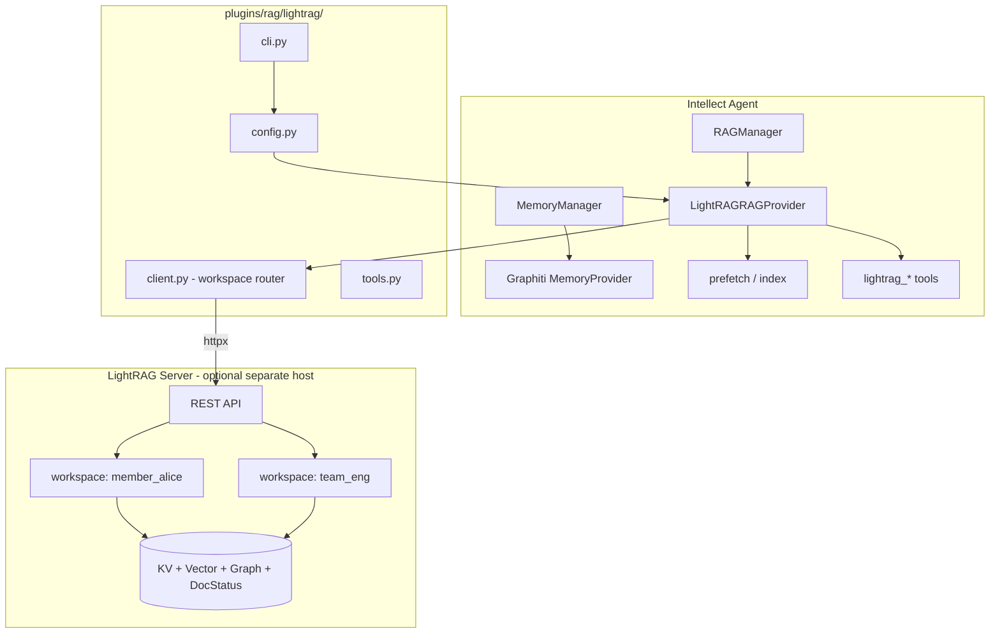
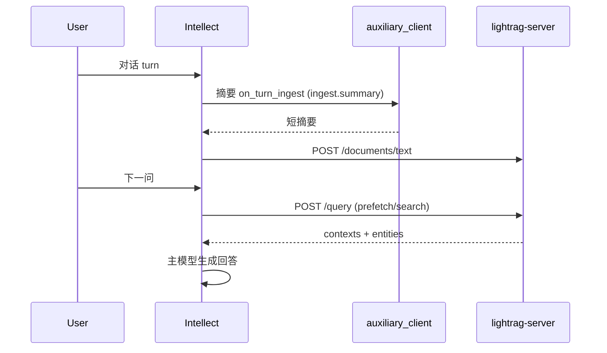

# LightRAG RAG Plugin — 集成设计方案

**日期：** 2026-06-06（rev.3）  
**状态：** R1+P0–P3+ 已落地 `feat/lightrag-r1-p0`；用户文档见 [`plugins/rag/lightrag/README.md`](../../plugins/rag/lightrag/README.md)  
**参考：** [HKUDS/LightRAG](https://github.com/HKUDS/LightRAG) · [多库架构 §15.8](2026-06-02-multi-database-cache-mq-design.md) · [Graphiti 插件计划](graphiti-memory-plugin-dev-plan.md)

### 已确认决议（2026-06-06）

| # | 议题 | 决议 |
|---|------|------|
| 1 | **仓库归属** | 源码置于 **`plugins/rag/lightrag/`**（与 [多库设计 R1–R3](2026-06-02-multi-database-cache-mq-design.md) 一致），**不**进入 `plugins/memory/` |
| 3 | **Server 托管** | **提供**官方 `docker-compose` 片段，并与 intellect-webui 多容器 compose 联动 |
| 6 | **运行时形态** | **仅外置**：Intellect 进程内不嵌入 `lightrag-hku` SDK；只通过 `lightrag-server` REST 通信 |

已确认（§14.3）：入库 `off`+setup opt-in、prefetch `hybrid`、RBAC 方案 A（P1）。实现计划见 [`2026-06-06-lightrag-r1-p0-implementation-plan.md`](2026-06-06-lightrag-r1-p0-implementation-plan.md)。

---

## 1. 背景与目标

### 1.1 LightRAG 是什么

LightRAG 是 HKUDS 提出的轻量级 **图增强 RAG** 框架（EMNLP 2025），核心特征：

| 维度 | 说明 |
|------|------|
| 索引 | 文档 → 分块 → LLM 抽取实体/关系 → 双层 KG（实体级 + 关系级）+ 向量索引 |
| 检索 | `local` / `global` / `hybrid` / `naive` / `mix`（默认 `mix`）五种模式 |
| 存储 | 四类后端：KV、Vector、Graph、DocStatus（可文件/PostgreSQL/MongoDB/Neo4j 等） |
| 部署 | **官方推荐**：`lightrag-server` REST API；SDK（`lightrag-hku`）适合嵌入式/研究 |
| 隔离 | `--workspace` / `WORKSPACE` 实现多实例数据隔离 |
| 成本 | 入库阶段 LLM 调用密集（实体关系抽取）；查询阶段可用 rerank |

与 Intellect 现有 **Graphiti** 插件的定位差异：

| | Graphiti | LightRAG |
|---|----------|----------|
| 强项 | 对话 episode、双时态有效性、时序推理 | 大规模文档库、跨文档宏观主题、法律/医疗/金融类长文档 |
| 写入单元 | 对话 observation / episode | 文档 / 文本块 |
| 图模型 | 时序知识图（FalkorDB） | 实体-关系 KG + chunk 向量（可 Neo4j/PG/NetworkX） |
| 典型用户 | 「记住我们聊过什么」 | 「在这批 PDF/规范里找答案」 |

二者 **互补**，且应走 **不同插件面**：

| 插件面 | 目录 | 配置键 | 与 LightRAG 关系 |
|--------|------|--------|------------------|
| Memory | `plugins/memory/`（封闭，Graphiti 为例外） | `memory.provider` | ❌ LightRAG **不**占位此处 |
| RAG | **`plugins/rag/`**（新建） | `rag.provider` | ✅ LightRAG 主入口 |

因此 **Graphiti（对话记忆）与 LightRAG（文档 RAG）可同时启用**——这是选用 `plugins/rag/` 而非 `plugins/memory/` 的核心收益。

### 1.2 集成目标

1. 以 **`RAGProvider` 插件** 形式接入（见 [多库设计 §15.8.3](2026-06-02-multi-database-cache-mq-design.md)），源码路径 **`plugins/rag/lightrag/`**，配置 `rag.provider: lightrag`。
2. **不进入** `plugins/memory/`（遵守 AGENTS.md 封闭政策；Graphiti 为历史内树例外）。
3. **运行时仅外置 server**（已确认）：Intellect 侧只做 HTTP 客户端，不打包 `lightrag-hku` 进 agent 进程。
4. **最小核心扩展**：新增 `RAGProvider` ABC + `plugins/rag/` 发现 + `RAGManager` 编排（与 `MemoryManager` 平行）；**不**在 `run_agent.py` 写 LightRAG 硬编码。
5. 提供 **docker-compose** 部署模板（已确认），支持 dev 单机与 webui 三容器生产拓扑。
6. 与 Intellect **多租户** 和 **prompt cache** 约束对齐。

### 1.3 非目标（Phase 1）

- 不替代 Intellect 内置 `memory` 工具（短期偏好/会话笔记）。
- 不实现 LightRAG WebUI 的完整复刻（可链接外部 server UI）。
- 不在 Phase 1 接入 RagAnything 多模态管线（MinerU/Docling/VLM）；留 Phase 3。
- 不与 Graphiti 做双写/联合检索（避免复杂度爆炸；用户二选一）。

---

## 2. 集成模式对比（三种方案）

### 方案 A：Remote Client（推荐 Phase 1）

```
Intellect Agent                    LightRAG Server
┌─────────────────┐   HTTP/REST   ┌──────────────────┐
│ LightRAGMemory  │ ────────────► │ lightrag-server  │
│ Provider        │  /query       │ (lightrag-hku)   │
│ (plugin)        │  /documents/* │ + storage backends│
└─────────────────┘               └──────────────────┘
```

| 优点 | 缺点 |
|------|------|
| 与 LightRAG 官方集成建议一致 | 需独立部署/运维 server |
| 插件依赖轻（`httpx` only） | 网络延迟 + 可用性依赖 |
| 入库/查询并发由 server 管理 | workspace 与 server 版本需对齐 |
| 便于水平扩展（多 Intellect profile 共享一 server） | |

### 方案 B：Embedded SDK — **已否决（决议 #6）**

不在 Intellect agent 进程内运行 `lightrag.LightRAG`。若未来有强需求，仅考虑 sidecar 容器内的 server，而非 SDK 嵌入。

**最终：仅方案 A（Remote Client）。**

---

## 3. 总体架构



### 3.1 插件包结构（`plugins/rag/lightrag/`）

与 [多库设计 §15.8.3](2026-06-02-multi-database-cache-mq-design.md) 目录规划一致：

```
plugins/rag/
├── __init__.py                 # RAGProvider ABC + discover_rag_providers() + load_rag_provider()
├── lightrag/
│   ├── plugin.yaml
│   ├── README.md
│   ├── __init__.py             # LightRAGRAGProvider(RAGProvider)
│   ├── config.py               # → $INTELLECT_HOME/lightrag/config.json
│   ├── client.py               # RestClient + workspace router + CircuitBreaker
│   ├── tools.py                # lightrag_* tool schemas
│   ├── cli.py                  # intellect lightrag {setup,status,health}
│   └── provider.py             # 可选：从 __init__ 拆出实现体
└── basic/                      # 未来：轻量 chunk+embed（R2）
    └── ...

tests/plugins/rag/
├── test_rag_discovery.py
└── test_lightrag_provider.py
```

**发现顺序**（建议与 memory 对称）：

1. 捆绑：`plugins/rag/<name>/`
2. 用户：`$INTELLECT_HOME/plugins/rag/<name>/` 或 `$INTELLECT_HOME/plugins/<name>/`（带 `RAGProvider` 启发式）

**前置依赖（R1）**：`agent/rag_provider.py` 定义 ABC；`agent/rag_manager.py` 编排 prefetch/tools；`run_agent.py` 在 system prompt 组装与 pre-turn 处各加 **一行委托**（与 `MemoryManager` 同模式）。LightRAG 插件本身不含 LightRAG 专有逻辑进 core。

### 3.2 plugin.yaml 草案

```yaml
name: lightrag
version: 0.1.0
description: >
  LightRAG — dual-level graph RAG for document corpora and long-form knowledge.
  Connects to lightrag-server (recommended) or embedded SDK (optional).
pip_dependencies:
  - httpx>=0.28.1,<1
kind: rag
```

---

## 4. RAGProvider 生命周期映射

### 4.1 与 LightRAG 概念的对应

| RAGProvider 方法 | LightRAG 操作 | 说明 |
|------------------|---------------|------|
| `initialize(config)` | `GET /health`；绑定 workspace 策略 | 不预加载全库 |
| `prefetch(query, collections)` | `POST /query`（仅 context） | 注入 `<rag-context>` 围栏（与 memory 围栏平行） |
| `search(query, collection, top_k)` | `POST /query` | 工具层 / 显式检索 |
| `index(source, collection)` | `POST /documents/upload` 或 `/documents/text` | 文档/文本入库 |
| `list_collections()` | 映射为 workspace 列表 | 通过 server 文档 API |
| `delete_collection(name)` | 清空 workspace 文档 | admin 工具 |
| `get_tool_schemas()` | `lightrag_*` 六工具 | 注册进 agent toolset |
| `shutdown()` | 关闭 httpx 连接池 | |

**可选 hooks**（通过 `plugin.yaml` 或 `RAGManager` 扩展，P1）：

| Hook | LightRAG 操作 |
|------|---------------|
| `on_turn_ingest`（若启用自动入库） | `POST /documents/text` |
| `on_session_end` | 批量摘要入库 |
| `on_pre_compress` | 压缩前事实抽取入库 |

**关键设计决策 — 对话 vs 文档：**

LightRAG 为 **文档索引** 优化。自动入库若写全量 user+assistant 会导致：

- 大量重复 chunk、实体抽取 LLM 费用高
- 图噪声（闲聊、工具输出）污染 KG

**建议策略（可配置 `ingest.mode`）：**

| 模式 | 行为 | 适用 |
|------|------|------|
| `off` | 仅工具/显式上传入库 | 纯文档 RAG |
| `summary` | auxiliary LLM 生成 3–5 句摘要 → `/documents/text` | 对话沉淀（CLI opt-in） |
| `full` | 原文入库 | 调试/小规模 |

摘要 LLM 走 Intellect **`agent/auxiliary_client.py`**，任务名 **`lightrag`**（`config.yaml` → `auxiliary.lightrag`；默认 `provider: auto` 跟随主模型链）。与 `auxiliary.compression` 解耦，避免摘要 ingest 影响 context compression 配置。

未配置 `auxiliary.lightrag` 时行为等同 `provider: auto`（解析顺序与 compression 相同，但读取独立配置块）。避免用 LightRAG server 的 EXTRACT LLM 处理短摘要文本。

### 4.2 prefetch 与 prompt cache

遵守 AGENTS.md **cache-breaking** 规则：

- `prefetch()` 仅在 **turn 开始前** 注入 `<memory-context>` 围栏内容（`MemoryManager.sanitize_context` 已处理）。
- 自动入库 / 工具写入 **不** 触发 mid-conversation system prompt 重建。
- `/memory provider lightrag` 类 slash 命令遵循 deferred invalidation（`--now` 可选）。

### 4.3 Cron / 子 agent 行为

- Cron 默认 `skip_memory=True` → LightRAG 不运行（与现有 provider 一致）。
- `agent_context != "primary"` 时跳过写入，仅允许只读 prefetch（可配置关闭）。

---

## 5. Workspace 与多租户隔离

LightRAG 原生支持 `workspace` 隔离（[API Server 文档](https://github.com/HKUDS/LightRAG/blob/main/docs/LightRAG-API-Server.md)）。

### 5.1 命名规范（对齐 Graphiti）

| Intellect 作用域 | LightRAG workspace | 示例 |
|-----------------|-------------------|------|
| 默认（无 member） | `session_{session_id}` 或 `global` | `session_abc123` |
| member | `member_{member_id}` | `member_alice` |
| team | `team_{team_id}` | `team_platform` |
| project | `project_{project_id}` | `project_acme_api` |

`LightRAGClientManager.bind_scope(member_id, team_id, project_id)` 与 Graphiti `GraphitiClientManager` 同构。

### 5.2 检索范围 `scope` 参数（工具 + prefetch）

| scope | 搜索的 workspace |
|-------|-----------------|
| `auto`（默认） | member + team（有则合并查询结果） |
| `member` | 仅 member |
| `team` | 仅 team |
| `project` | 仅 project |
| `all` | 全部（需 RBAC admin） |

**REST 实现：** 每个 workspace 独立 `POST /query`；`auto` 时并行查询 + 去重合并（reference_id/file_path）。

### 5.3 与 v2 RBAC 集成

在插件侧 + `agent/member_rbac.py` 注册（见 §14.3 问题 5）：

| 工具 | 最低权限 |
|------|---------|
| `lightrag_query` | read |
| `lightrag_search` | read |
| `lightrag_insert_text` | chat |
| `lightrag_upload_document` | chat |
| `lightrag_delete_document` | admin |
| `lightrag_clear_workspace` | admin |

---

## 6. 工具面设计（Agent Tools）

建议 **5–6 个**工具（控制 schema 体积；MemoryManager 已有单 provider 限制）。

### 6.1 工具列表

| 工具名 | 用途 | 映射 API |
|--------|------|----------|
| `lightrag_query` | 带模式的 RAG 问答（返回 answer + citations） | `POST /query` 或 `/query/stream`（插件内聚合非流式） |
| `lightrag_search` | 仅检索上下文（不生成答案），供 agent 自行推理 | `POST /query` + `only_need_context=true` |
| `lightrag_insert_text` | 写入文本片段（笔记、摘要、代码说明） | `POST /documents/text` |
| `lightrag_upload_document` | 上传文件路径或 URL（受 Intellect 路径沙箱约束） | `POST /documents/upload` |
| `lightrag_list_documents` | 列出 workspace 内文档状态 | `GET /documents` 或 track_status |
| `lightrag_delete_document` | 删除文档并触发 KG 重建 | `DELETE /documents/{id}`（admin） |

**不在 Phase 1 暴露：** `/documents/scan`（目录扫描）、图谱可视化、Ollama 兼容 chat 端点。

### 6.2 `lightrag_query` 参数要点

```json
{
  "query": "string (required)",
  "mode": "mix | hybrid | local | global | naive",
  "scope": "auto | member | team | project",
  "enable_rerank": true,
  "include_chunk_content": false
}
```

默认 `mode=mix`（LightRAG 推荐）。在 system prompt 中说明各模式适用场景（与官方 README 一致）。

---

## 7. 配置模型

存储于 `$INTELLECT_HOME/lightrag/config.json`（profile-aware）。

```json
{
  "mode": "remote",
  "server": {
    "base_url": "http://127.0.0.1:9621",
    "api_key": "",
    "timeout_seconds": 120
  },
  "workspace": {
    "strategy": "member_team_project",
    "fallback": "session"
  },
  "ingest": {
    "sync_turn_mode": "summary",
    "summary_max_tokens": 256,
    "session_end_min_turns": 3,
    "pre_compress": true
  },
  "query": {
    "default_mode": "mix",
    "prefetch_mode": "hybrid",
    "enable_rerank": true,
    "max_context_tokens": 4000
  },
  "embedded": {
    "working_dir": "~/.intellect/lightrag/workspaces",
    "llm_binding": "openai_compatible",
    "embedding_binding": "ollama"
  }
}
```

### 7.1 config.yaml 集成

在插件 `get_config_schema()` 中声明 wizard 字段；**secrets**（server API key）不进 `config.yaml`，走：

- `$INTELLECT_HOME/lightrag/config.json`（chmod 0600）
- 或 `LIGHTRAG_SERVER_API_KEY` in `.env`（`OPTIONAL_ENV_VARS` 由插件 README 文档化，不强制改 core）

顶层 `rag.provider: lightrag` 激活 provider（与 `memory.provider` 独立）。

### 7.2 与 LightRAG Server 的环境分工

| 配置项 | 谁负责 | 说明 |
|--------|--------|------|
| LLM / Embedding / Rerank | **LightRAG Server** `.env` | EXTRACT/QUERY/KEYWORDS 角色分离 |
| Server URL / workspace 策略 | **Intellect 插件** | |
| 对话摘要 LLM | **Intellect `auxiliary.lightrag`** | `ingest.py` → `call_llm(task="lightrag")` |
| Server LLM/Embedding 同步 | **`intellect lightrag sync-server-env`** | 从 `model.*` + runtime 生成 `deploy/lightrag/.env` |
| 文档解析管线 MinerU 等 | **LightRAG Server** | `lightrag_upload_document` 的 `parse_engine` / `analyze_*` filename hint |

### 7.3 `auxiliary.lightrag`（Intellect 侧）

```yaml
# ~/.intellect/config.yaml
auxiliary:
  lightrag:
    provider: auto              # auto | openrouter | custom | ...
    model: ""                   # 空 = 跟随 auto 链；可 pin 便宜模型
    base_url: ""
    api_key: ""
    timeout: 60
```

仅用于 `ingest.auto_mode: summary|full` 的摘要生成，**不**影响 LightRAG server 的 EXTRACT/QUERY。

### 7.4 `sync-server-env`（Server 侧）

```bash
intellect lightrag sync-server-env [--docker] [--dry-run] [-o PATH] [--embedding-model MODEL]
```

实现：`plugins/rag/lightrag/sync_env.py`。读取 `intellect_cli.runtime_provider.resolve_runtime_provider()` + `config.yaml` `model.default`，写出 LightRAG 认识的 `LLM_BINDING` / `EMBEDDING_BINDING` 等。OAuth-only provider（Codex 等）会警告并留空 key 供人工填写。

| Intellect | 生成的 server 绑定 |
|-----------|-------------------|
| OpenRouter / OpenAI 兼容 | `LLM_BINDING=openai` + `LLM_BINDING_HOST` |
| Ollama / 本地 `:11434` | `LLM_BINDING=ollama`；embedding 默认同 host + `bge-m3:latest` |
| `--docker` | `localhost` → `host.docker.internal` |

默认输出：`deploy/lightrag/.env`（在仓库内）或 `~/.intellect/lightrag/server.env`。

---

## 8. 存储与部署拓扑（含官方 compose — 决议 #3）

### 8.1 仓库内交付物

在 intellect-agent 或 intellect-webui 仓提供可拷贝模板：

```
deploy/lightrag/
├── docker-compose.yml               # 极简：仅 lightrag-server + 文件存储
├── docker-compose.webui.yml         # lightrag + postgres-lightrag（可并入 webui 栈）
├── .env.example                     # 手工编辑；或用 intellect lightrag sync-server-env 生成
├── README.md
plugins/rag/lightrag/
└── README.md                        # 插件用户指南（CLI、config、双模型平面）
```

**与 webui 三容器联动**（类比 Graphiti + FalkorDB，见 [graphiti 计划 §5](graphiti-memory-plugin-dev-plan.md)）：

```yaml
# docker-compose.three-container.yml 片段（intellect-webui 仓）
services:
  intellect-agent:
    environment:
      RAG_PROVIDER: lightrag
      LIGHTRAG_SERVER_URL: http://lightrag:9621
    depends_on:
      lightrag:
        condition: service_healthy

  lightrag:
    image: ghcr.io/hkuds/lightrag:latest   # 或 pin digest
    ports:
      - "9621:9621"                         # 可选暴露给宿主机调试
    env_file:
      - ./deploy/lightrag/.env
    volumes:
      - lightrag-data:/app/data
    healthcheck:
      test: ["CMD", "curl", "-f", "http://localhost:9621/health"]
      interval: 30s
      timeout: 10s
      retries: 3
    depends_on:
      - postgres-lightrag

  postgres-lightrag:
    image: pgvector/pgvector:pg16
    environment:
      POSTGRES_DB: lightrag
      POSTGRES_USER: lightrag
      POSTGRES_PASSWORD: ${LIGHTRAG_PG_PASSWORD}
    volumes:
      - lightrag-pg-data:/var/lib/postgresql/data

  # 可选：本地 embedding，减轻 OpenAI embedding 费用
  ollama:
    image: ollama/ollama:latest
    volumes:
      - ollama-data:/root/.ollama

volumes:
  lightrag-data:
  lightrag-pg-data:
  ollama-data:
```

Intellect agent / gateway **不** 与 LightRAG 同容器；仅 HTTP 调用 `http://lightrag:9621`。

### 8.1.1 `.env` 最小生产示例

```bash
# deploy/lightrag/.env
LLM_BINDING=openai
LLM_MODEL=gpt-4o-mini
LLM_BINDING_HOST=https://api.openai.com/v1
LLM_BINDING_API_KEY=${OPENAI_API_KEY}

EMBEDDING_BINDING=ollama
EMBEDDING_MODEL=bge-m3:latest
EMBEDDING_BINDING_HOST=http://ollama:11434

# PostgreSQL 四存储合一（推荐生产）
POSTGRES_HOST=postgres-lightrag
POSTGRES_PORT=5432
POSTGRES_USER=lightrag
POSTGRES_PASSWORD=${LIGHTRAG_PG_PASSWORD}
POSTGRES_DATABASE=lightrag

# workspace 留空 — Intellect 插件按 member/team/project 传参
WORKSPACE=
```

### 8.2 开发拓扑

- `lightrag-server` 本机 9621
- 默认 file storage（`./rag_storage`）
- Embedding：Ollama `bge-m3` 本地

### 8.3 存储选型建议

| 规模 | 推荐 |
|------|------|
| 个人 / PoC | JsonKV + NetworkX + NanoVector（server 默认） |
| 团队生产 | PostgreSQL 四存储合一 |
| 已有 Neo4j 运维 | `GRAPH_STORAGE=Neo4JStorage` + PG vector |
| 多 workspace 大规模 | Qdrant payload 分区 或 PG workspace 字段 |

---

## 9. LLM / Embedding 策略

### 9.1 职责分离



- **入库抽取（实体/关系）**：LightRAG server EXTRACT LLM（较重，仅对入库文本触发）。
- **对话摘要**：Intellect auxiliary（轻量，Haiku/Flash 类）。
- **prefetch 检索**：LightRAG QUERY 路径的 keyword + graph 检索；**避免** prefetch 再调一次完整生成（费钱 + 与主模型重复）。

### 9.2 依赖版本

```toml
# intellect-lightrag-plugin/pyproject.toml
dependencies = [
  "httpx>=0.28.1,<1",
]
optional = [
  "lightrag-hku>=1.5.0,<2",  # Phase 2 embedded
]
```

遵守 Intellect 依赖上界政策；`lightrag-hku` 用 `<2` 主版本上限。

---

## 10. CLI 与运维

```bash
intellect lightrag setup              # server URL、health、opt-in summary ingest
intellect lightrag status [--json]    # 配置路径 + 健康状态
intellect lightrag health [--json]    # GET /health 详情
intellect lightrag workspaces         # 各 workspace 文档数（--scope all）
intellect lightrag doctor             # 插件自检（intellect doctor 子集）
intellect lightrag sync-server-env    # 从 Intellect model 生成 server .env（--docker）
intellect lightrag mcp start          # MCP stdio（Cursor / Claude Desktop）
intellect lightrag mcp config         # MCP 客户端配置片段
```

Compose 冒烟：`scripts/smoke_lightrag_compose.sh`（`--up` 启动、`--full` 需 server LLM+embedding）。

`intellect doctor` 在 `rag.provider: lightrag` 时展示 **RAG Provider** 段（`plugins/rag/lightrag/doctor.py`）。

用户文档：[`plugins/rag/lightrag/README.md`](../../plugins/rag/lightrag/README.md)、[`deploy/lightrag/README.md`](../../deploy/lightrag/README.md)。

---

## 11. 错误处理与熔断

复用 Graphiti `CircuitBreaker` 模式（可复制到插件内，不依赖 core）：

| 条件 | 行为 |
|------|------|
| 连续 3 次 server 5xx/超时 | 开闸 30s；`prefetch` 返回空；工具返回 JSON 错误 |
| 401/403 | 提示检查 `api_key` / server auth |
| 409 pipeline busy | 工具层重试或提示「索引进行中」 |
| embedding 维度变更 | doctor 检测；提示清空 workspace 重建 |

---

## 12. 测试策略

| 层级 | 内容 |
|------|------|
| Unit | workspace 路由、配置 load/save、工具 schema、摘要模式分支 |
| Contract | mock `httpx` 录制 LightRAG OpenAPI 响应 |
| Integration | `scripts/smoke_lightrag_compose.sh`（health）；`--full` 为 live insert/query |
| E2E | `sync-server-env` → compose up → `lightrag setup` → insert/search 往返 |

**禁止：** 全量 live LLM 测试进默认 CI（与 Graphiti 策略一致）。

---

## 13. 分阶段交付计划

| Phase | 范围 | 交付物 | 估时 |
|-------|------|--------|------|
| **P0** | 仓库脚手架 + Remote client + `lightrag_search`/`insert_text` + prefetch | 可安装插件 α | 1–2 周 |
| **P1** | 全工具面 + session_end/pre_compress + CLI setup/status + RBAC | β，文档齐全 | 1–2 周 |
| **P2** | doctor + webui compose + 并行 query | ✅ 已交付 | 1 周 |
| **P3** | 多模态上传 + MCP bridge + `kind: rag` | ✅ 已交付 | |
| **P3+** | `sync-server-env` + `auxiliary.lightrag` | ✅ 已交付 | |

**前置 R1**（可与 P0 并行）：`RAGProvider` ABC + `plugins/rag/__init__.py` + `RAGManager` 最小接线。

**P0 Exit gate：**

```bash
rag.provider: lightrag
intellect lightrag status  # → server OK
# 对话后 prefetch 出现相关 context；lightrag_insert_text + lightrag_search 往返
```

---

## 14. 风险与开放问题

### 14.1 已识别风险

| 风险 | 缓解 |
|------|------|
| 入库 LLM 成本高 | 默认 `ingest.auto_mode: off`；opt-in `summary` |
| Server 与插件版本漂移 | `status` 检查 server 版本；CI contract test 锁 OpenAPI |
| workspace 误配导致数据混用 | setup 向导强制测试写入/读取；命名规范文档化 |
| 与 Graphiti 功能重叠引用户困惑 | README 定位表 + `intellect memory` 选择向导文案 |
| Memory/RAG 分工不清 | 文档 + setup 向导区分 `memory.provider` vs `rag.provider` |

### 14.2 已确认决议（见文首表）

### 14.3 已确认 — 详细说明

#### 问题 2：默认入库模式（`ingest.auto_mode`）

LightRAG 入库会触发 **EXTRACT LLM**（实体/关系抽取），成本远高于普通 memory 写入。三种模式对比如下：

| 模式 | 每 turn 行为 | 单次额外成本（粗估） | 适用场景 |
|------|-------------|---------------------|----------|
| **`off`** | 仅 `lightrag_insert_text` / `lightrag_upload_document` 显式入库 | $0 自动开销 | 纯文档库、合规场景（用户数据不进 RAG）、网关多租户 |
| **`summary`** | auxiliary LLM 生成 3–5 句摘要 → `/documents/text` | ~1 auxiliary call + 1 EXTRACT 链路/turn | 个人 CLI、「边聊边积累知识库」 |
| **`full`** | 原文 user+assistant 入库 | 最高（长文本 EXTRACT） | 调试；**不推荐**生产默认 |

**网关 / 多用户考量：**

- 若 `ingest.auto_mode != off`，每个 member 的对话都会写入其 workspace，需确认 **数据保留策略** 与 **配额**（server 侧 `MAX_PARALLEL_INSERT`、LLM 预算）。
- Cron / 子 agent / `agent_context != primary`：**一律强制 `off`**（与 Graphiti 一致），不可配置覆盖。

**推荐默认（供你选择）：**

| 部署形态 | 建议默认 | 理由 |
|----------|----------|------|
| CLI 个人开发者 | `summary` | 开箱即用「越聊越懂」 |
| Gateway / 多 member | **`off`** | 避免无意入库 PII；由用户/技能显式 `upload` |
| 企业文档助手 | `off` | 语料来自批量上传，不靠对话沉淀 |

**折中方案（推荐采纳）：** `ingest.auto_mode` 默认 `off`，setup 向导对 CLI-only 安装提供「启用对话摘要入库？」一步 opt-in。

---

#### 问题 4：prefetch 强度（`query.prefetch_policy`）

`prefetch` 在每 turn 开始前调用 LightRAG `POST /query`（即使只要 context，也有 server RTT + keyword 抽取）。

| 策略 | 行为 | 延迟影响 | 召回质量 |
|------|------|----------|----------|
| **`always`** | 每 user message 都 prefetch | +200ms–2s/turn（视 server 负载） | 最稳；闲聊也检索，噪声↑ |
| **`intent`** | 正则/轻量分类器命中才 prefetch | 平均低；可能漏召回 | 需维护触发词表 |
| **`hybrid`**（推荐候选） | `always` 当消息含文档域关键词；否则仅当长度≥N 或带 `?` | 平衡 | 默认 N=40，可配置 |

**Intent 触发词示例（中英）：** `文档、规范、政策、之前上传、according to、spec、README、合同、手册、lightrag、知识库`

**与 prompt cache：** prefetch 结果包在 `<rag-context>` 围栏内，仅 turn 初注入一次，**不** mid-turn 变更 — 与 memory prefetch 相同。

**与 Graphiti 共存：** 同一 turn 可能先后调用 `MemoryManager.prefetch` + `RAGManager.prefetch`；需设 **总 token 预算**（建议 `rag.max_prefetch_tokens: 2000`，与 memory 独立计数）。

**推荐默认（供你选择）：**

```yaml
rag:
  provider: lightrag
  prefetch_policy: hybrid   # 非 always
  prefetch_min_chars: 40
  prefetch_modes: hybrid      # LightRAG query mode for prefetch only
```

若 corpus 以 **预上传文档** 为主、对话很少引用，选 **`intent`** 更省；若以 **探索型问答** 为主，选 **`hybrid`**。

---

#### 问题 5：RBAC 注册方式

多 member 场景下，`lightrag_delete_document` / `lightrag_clear_workspace` 必须受限。

| 方案 | 做法 | 优点 | 缺点 |
|------|------|------|------|
| **A. 插件内校验** | `provider.py` 调 `check_member_tool_permission()`（复制 Graphiti 模式） | 不改 core；独立发布 | 须在 `agent/member_rbac.py` **硬编码工具名** 才能统一审计 → 仍需小 PR |
| **B. 声明式注册** | `plugin.yaml` 增 `rbac_tools:` 块；core 启动时合并进 RBAC | 插件自描述；新工具不需改 rbac 文件 | 需新增 **通用 hook**（~50 行 core） |
| **C. 仅文档** | README 写「生产请禁用危险工具」 | 零 core | 不安全，不适合 gateway |

**Graphiti 先例：** Phase 2 在 `agent/member_rbac.py` 注册了 5 个 `graphiti_*` 工具 — LightRAG 若走 **方案 A**，P1 需同样提交 ~15 行 RBAC 映射（**可接受的最小 core 改动**）。

**推荐：方案 A（P1）+ 方案 B 作 RAG 面通用化（R1.1 后续）**

```python
# agent/member_rbac.py 增量示例（P1）
"lightrag_query": Action.READ,
"lightrag_search": Action.READ,
"lightrag_insert_text": Action.CHAT,
"lightrag_upload_document": Action.CHAT,
"lightrag_delete_document": Action.ADMIN,
"lightrag_clear_workspace": Action.ADMIN,
```

插件内 **防御性二次校验**（Graphiti `delete_episode` 同款）：即使 RBAC 未启用，admin 工具也要求 `reason` 参数。

---

## 15. 推荐决议（更新）

| 议题 | 建议 |
|------|------|
| 插件面 | **`RAGProvider`** @ `plugins/rag/lightrag/` |
| 与 Graphiti | **可并存**（memory + rag 分工） |
| 集成模式 | **仅 Remote server**（决议 #6） |
| Compose | **提供** dev + three-container 模板（决议 #3） |
| 入库默认 | **`off`** + setup opt-in `summary`（§14.3 已确认） |
| Prefetch | **`hybrid`**（§14.3 已确认） |
| RBAC | **方案 A** 最小 PR + 插件内二次校验（§14.3 已确认，**P1**） |
| 多租户 | workspace = member/team/project 前缀 |

---

## 16. 参考实现索引（本仓库）

实现时可直接对照：

| 文件 | 可复用模式 |
|------|-----------|
| `plugins/memory/graphiti/__init__.py` | MemoryProvider 全生命周期 |
| `plugins/memory/graphiti/client.py` | 异步线程 + scope 路由 + CircuitBreaker |
| `plugins/memory/graphiti/tools.py` | 工具 schema 风格 |
| `plugins/memory/graphiti/config.py` | setup wizard schema |
| `plugins/memory/hindsight/__init__.py` | 远程 API + 本地 embedded 双模式 |
| `agent/memory_manager.py` | prefetch 围栏 / 单 provider 限制 |
| `docs/plans/2026-06-02-multi-database-cache-mq-design.md` §15.8 | `RAGProvider` + `plugins/rag/` 原始规划 |
| `plugins/memory/__init__.py` | 发现机制模板（复制为 `plugins/rag/__init__.py`） |

---

## 附录 A：LightRAG REST 端点速查（Remote 模式）

| 端点 | 插件用途 |
|------|----------|
| `GET /health` | setup / doctor |
| `POST /query` | prefetch、`lightrag_query`、`lightrag_search` |
| `POST /documents/text` | on_turn_ingest / insert_text |
| `POST /documents/texts` | on_session_end 批量 |
| `POST /documents/upload` | upload_document |
| `DELETE /documents/*` | delete_document |
| `GET /documents/track_status/{id}` | 异步入库轮询 |

详细参数见 [LightRAG-API-Server.md](https://github.com/HKUDS/LightRAG/blob/main/docs/LightRAG-API-Server.md)。

---

## 附录 B：配置示例（端到端）

```yaml
# ~/.intellect/config.yaml
memory:
  provider: graphiti
rag:
  provider: lightrag
  prefetch_policy: hybrid
  max_prefetch_tokens: 2000

auxiliary:
  lightrag:
    provider: openrouter
    model: google/gemini-2.5-flash   # 摘要专用；省略则 auto 跟随主模型

# ~/.intellect/lightrag/config.json
{
  "server": { "base_url": "http://127.0.0.1:9621", "timeout_seconds": 120 },
  "ingest": { "auto_mode": "summary" },
  "query": { "prefetch_mode": "hybrid", "default_mode": "mix" }
}
```

```bash
# 1. 从当前 Intellect 模型生成 server .env
intellect lightrag sync-server-env --docker

# 2. 启动 server
cd deploy/lightrag && docker compose -f docker-compose.webui.yml up -d lightrag

# 3. 插件 + 冒烟
intellect lightrag setup
scripts/smoke_lightrag_compose.sh --full
```

生成的 `deploy/lightrag/.env` 示例（OpenRouter 主模型时）：

```bash
LLM_BINDING=openai
LLM_MODEL=google/gemini-2.5-flash
LLM_BINDING_HOST=https://openrouter.ai/api/v1
OPENROUTER_API_KEY=
EMBEDDING_BINDING=openai
EMBEDDING_MODEL=text-embedding-3-small
WORKSPACE=
```

本地 Ollama 时 `sync-server-env` 产出 `LLM_BINDING=ollama`、`EMBEDDING_BINDING=ollama`、`EMBEDDING_MODEL=bge-m3:latest`。

---

*R1+P0 任务分解见 [`2026-06-06-lightrag-r1-p0-implementation-plan.md`](2026-06-06-lightrag-r1-p0-implementation-plan.md)。*
